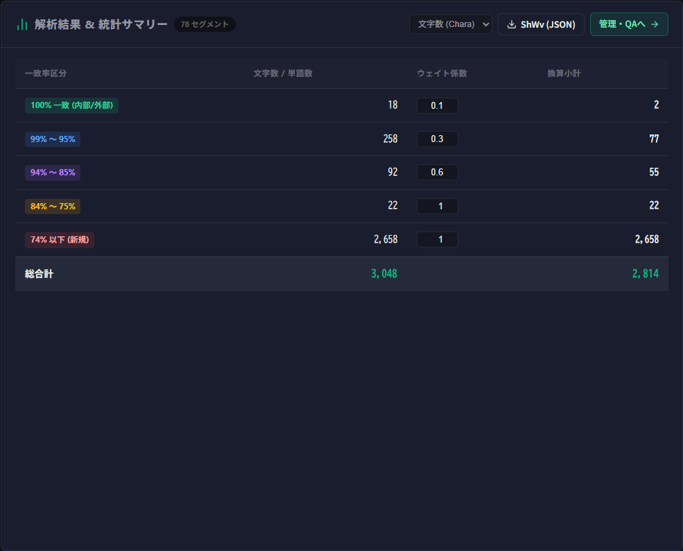
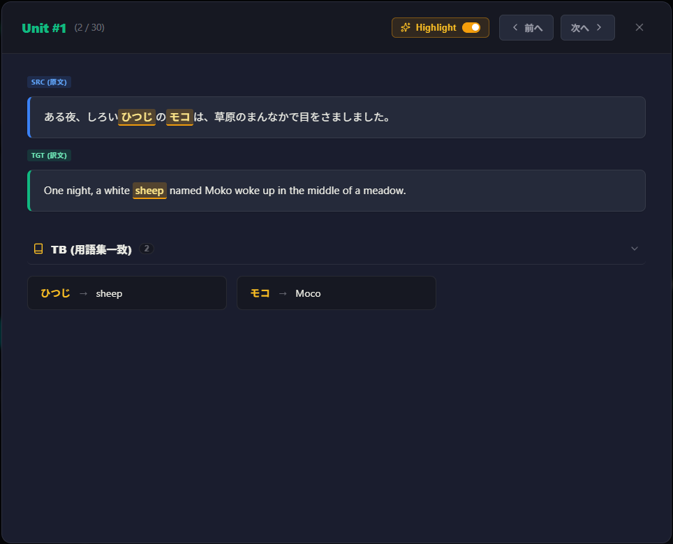
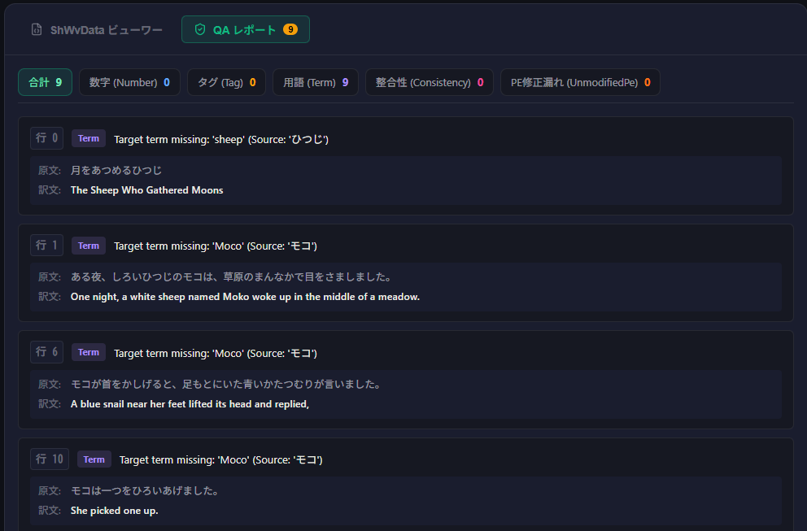
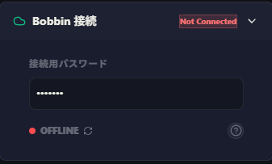
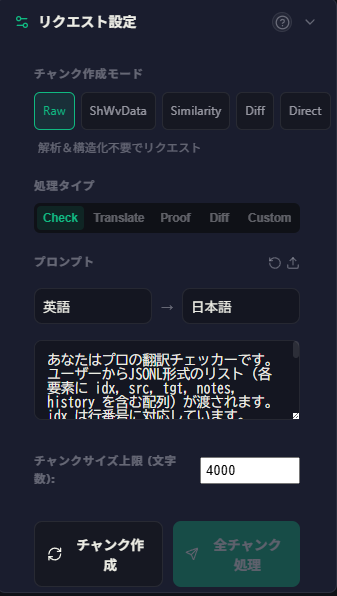
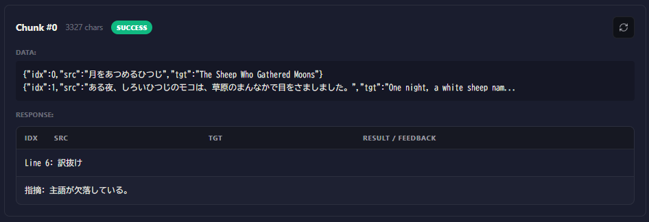
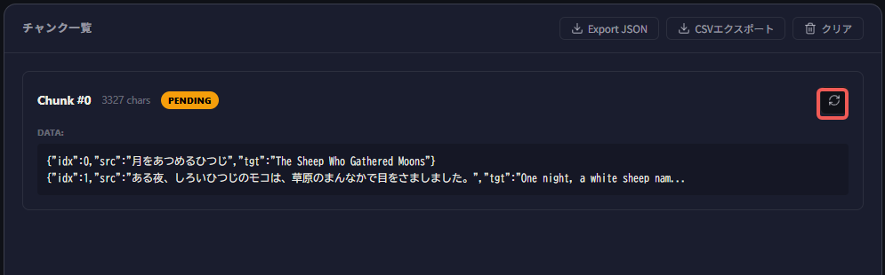

# SheepShuttle 対訳データ処理の基本フロー

SheepComb で操作できる SheepShuttle の機能は以下のとおりです。
基本的には、画面上部メニューの「SheepShuttle」から、順を追って進めていきます。

| | 機能名 | 概要 |
| :---: | :--- | :--- |
| 1a | **抽出（パース）** | 各種ファイルから原文と訳文のペアを取り出します。|
| 1b | **除外・絞り込み（フィルタ）** | 不要なデータや重複などを取り除きます。|
| 2 | **解析・構造化** | 翻訳メモリ（TM）や用語集（TB）とともに複数のデータをまとめ、本ツールで使える「プロジェクトデータ」を作成します。|
| 3 | **管理・QA** | 構造化したデータを可視化します。また、TM や TB との比較（QA）を行うこともできます。|
| 4 | **ビルド** | 構造化データを修正した後に、もとの XLIFF へと戻します。|
| 5 | **AI リクエスト（API）** | 小分けにしたデータと指示（プロンプト）を AI へ送り、一括で翻訳やチェックを行います。|

# 各ステップの詳細手順
## 1a：データの抽出

最初に対象のファイルから翻訳データを抽出します。

1. メニューから「抽出」を選択します。
2. 画面左上のアップロードエリアに、処理したいファイルをドラッグ＆ドロップするか、クリックしてファイルを選択します。
3. **「解析を実行」** ボタンをクリックします。

::: tip
Excel や XLIFF でテキスト内に改行が含まれている場合、抽出時に改行で分割されます。
もしこの改行も保持したい場合は、「解析を実行」の上にある「改行で分割してパースする」のチェックを外してください。
:::

::: info 対応しているファイル形式
- **XLIFF 関連**：`.xliff`, `.xlf`, `.sdlxliff`, `.mxliff`, `.mqxliff` などの各種翻訳ツール用対訳ファイル
- **翻訳メモリ・用語集**：`.tmx`, `.tbx`
- **Excel/CSV**：`.xlsx`(A 列に原文、B 列に訳文、C 列以降にその他の情報), `.csv`, `.tsv`
- **その他**：Word (`.docx`)の表、`JSON` / `JSONL` 形式のファイル
:::

解析が終わると、右側に原文・訳文・備考が一覧表示されます。

### 文字数の確認
一覧表の上には概算の文字数・単語数が表示されます。文字数（Chara）と単語数（Word）をクリックすると、表示を切り替えられます。
また、後述のフィルタやサンプリングでデータの項目数が減った場合も、リアルタイムで反映されます。

### ダウンロード
抽出したデータがファイルとして必要な場合は、右上にある CSV または JSON ボタンをクリックすることでダウンロードできます。
こちらも後述のフィルタやサンプリングでデータの項目数が減った場合、加工後のデータがダウンロードされます。

### 抽出したデータについて
なお、抽出したデータはブラウザ自体に保存され、次回開いたときにも保持されています（ただし、テキストベースで 5 MB 程度まで）。
ブラウザに残っているデータを消去したい場合は、右上にあるゴミ箱のアイコンをクリックしてください。

## 1b：データの除外・絞り込み

データを抽出すると、**アクション** のカードに **フィルタ** と **サンプリング** の項目が表示されます。

抽出したデータを目的に応じて加工することができます。

### フィルタ

指定した条件に合う行を減らす工程です。
不要な行を減らすことで、データサイズが軽くなり、後の処理も便利になります。
ただし、削除した行は元に戻せませんので、「重複も重要なデータ」である場合などは、慎重に行ってください。

フィルタには以下の 3 つの項目があります。

| 機能名 | 概要 |
| :---: | :--- |
| **重複行を削除** | 全く同じ原文と訳文のペアがある場合、2 件目以降を自動的に削除します。 同じと判定される条件について、原文・訳文・備考のどこまで一致している必要があるか、右側のドロップダウンで指定できます。|
| **LOCKED 行を削除** | 編集不可としてロックされている行を除外します（mxliff/mqxliff からの抽出のみ）。|
| **翻訳不要（DNT）フィルタ** | 翻訳する必要のない行を自動で判定して除外します。この機能を使うには、チェックを入れた上で、下部の DNT フィルタから除外対象を選んでください。|

フィルタを適用した条件にチェックを入れたら、**フィルタ実行** をクリックします。
すると、右側の一覧からチェックを入れた行が除外されます。

### サンプリング評価

大量のデータから、一部だけを抜き出して品質テストを行いたい場合に使用します。

| 機能名 | 概要 |
| :---: | :--- |
| **目標抽出文字数** | 抽出したい目安の合計文字数を指定します。|
| **シード値** | ランダム抽出の基準となる数値です。同じ数値を入れると常に同じ行が選ばれます（空欄にするとランダムに自動生成されます）。| 

設定後、**「サンプリング実行」** ボタンをクリックすると、右側にサンプリング結果が表示されますので、CSV/JSON 形式でダウンロードしてください。

## 2：解析・構造化

抽出・加工したデータを、システムが処理しやすい「プロジェクトデータ」へと変換・統合します。
対訳データに、過去の翻訳データ（翻訳メモリ/TM）や、決まった訳し方を指定する（用語集/TB）を追加して、1ファイルにまとめる作業です。
このプロジェクトデータは ShWvData というスキーマを採用しており、VS Code 拡張型 CAT ツール[SheepWeave](../sheep-weave/)で利用できます。
また、後述の LLM 連携で高度な機能（過去訳や用語集も情報として渡す）を利用するには、いったん構造化と解析を行う必要があります。

構造化の手順は次のとおりです。

1. メニューから「解析・構造化」を選択します。
2. 追加のファイルや、翻訳メモリ・用語集を追加します。
3. プロジェクトの基本情報を入力します。
  - **プロジェクト名**：わかりやすいプロジェクト名を入力します。
  - **ソース言語**（原文の言語）：英語、日本語、中国語などから選択します。
  - **ターゲット言語**（訳文の言語）：翻訳先の言語を選択します。
4. **「解析・構造化を実行」** ボタンをクリックします。

翻訳メモリ・用語集がない場合でも、抽出したデータ内での類似度を計測できます。

解析が完了すると、類似度の区分に応じた負荷割合を設定し、文字数として可視化できます（WWC）。

この係数は自由に変更可能です。

:::tip ファイル形式について
利用できるファイル形式は次のとおりです。
- **翻訳メモリ(TM)**：過去の対訳データ（`.tmx` `xlf` `sdlxliff` `.mxliff` `.mqxliff` `.csv` `xlsx` `json` `jsonl`）
- **用語集(TB)**：専門用語や指定訳のリスト（`.tbx` `xlf` `sdlxliff` `.mxliff` `.mqxliff` `.csv` `xlsx` `json` `jsonl`）
なお、`csv` `xlsx` については**原文・訳文・備考**の順に並んでいるものとし、`json` `jsonl` については SheepFamily ツールで出力されたものに限ります。
:::

## 3：データの管理・QA
### データの管理（可視化）

解析したプロジェクトデータを表示するステップです。

単純なパースに加え、この図のとおり、用語集（TB）として読み込んでいた内容とのマッチング状況や「どの文と似ているか」「どこがどう似ている/異なるか」を視覚的に確認できます。

各レコードをクリックすると、さらなる詳細を確認できます。

### データの管理（QA）
ところで、上の図では、**モコ** が **Moco** として指定されているにもかかわらず、訳文では **Moko** となっていますね。

こういったミスを一気に洗い出す機能が **QA** です。左側にあるQAカードを開くと、このような選択肢があります。

確認したい項目にチェックをいれて実行すると、QA レポートのタグが次のように更新されます。

この表を見ながら、必要な修正を訳文に加えていくことができます。

なお、各項目の詳細については次のとおりです。

|QA項目 | 概要 |
|:--|:--|
| **数字不一致** | 原文と訳文で数字が一致しない場合にチェックがつきます。 ※ チェックできるのは半角のアラビア数字のみです。| 
| **タグ / プレースホルダー** | タグやプレースホルダーの対応関係が一致しない場合にチェックがつきます。 ※ チェック対象は `<>` / `{}` / `[]` のみです。| 
| **用語集 (TB) 含有** | 用語集に登録されている用語と訳文が一致しない場合にチェックがつきます。|
| **整合性 (100%一致行)** | 原文がまったく同じにもかかわらず、訳文が異なっている場合にチェックがつきます。| 
| **PE修正漏れ (未編集の下訳)** | 構造化したデータを **SheepWeave** で翻訳する場合、下訳と確定訳の区別があります。下訳から修正してあるのに、その行と似ている他の行が修正されていない場合にチェックがつきます。| 

### データの管理（ファイル変換）

構造化したデータをファイル形式に書き出したり、AI向けの分割（チャンク化）を行ったりする工程です。
左側にある **データ操作・変換** カードで処理できます。

- **プロジェクトデータの保存・復元**
 - **データの書き出し**：現在のプロジェクト全体を本システム専用の形式（`.json`）や、Excel 等で開ける `.csv` 形式でダウンロードし、PC に保存できます。
 - **データの読み込み**：以前保存した `.json` ファイルをドロップすれば、いつでも前回の作業状態を再現できます。

- **AI 向けの分割（チャンク化）**
 AI は一度に大量の文章を処理すると精度が下がったり、エラーになったりします。そのため、適切な長さでデータを小分け（チャンク化）します。
 - **ファイル単位で分割**：元のファイルごとにデータを分けします。
 - **指定文字数で分割**：設定した文字数（例: 5000 文字）ごとに自動で均等に分割します。

- **JSONL 形式での書き出し・取り込み**
 - AI 処理用に `.jsonl` 形式で出力できます。また、AI 処理済みの `.jsonl` を読み込んで、結果を本システムに反映（上書き）することも可能です。

## 4：ビルド

構造化したプロジェクトデータを、翻訳ツールなどで利用できる形式（XLIFF など）に戻す工程です。
元となる XLIFF データ（`xlf` / `xliff` / `sdlxliff` / `mxliff` / `mqxliff`）を **バイリンガルファイル** として、調整後の構造化データを **構造化データ** として選択します（構造化データについては、ステップ 3 以前のものを流用可能）。
その後、アクションカード下部の **ビルド開始** ボタンを押すと、XLIFF データの `<target>` を置き換えた状態で出力されます。

## 5：AI（LLM）への依頼

デスクトップアプリ（SheepBobbin）と連携し、AI へ翻訳やチェックを一括で依頼します。

::: warning 準備
AI へのリクエストを行うには、あらかじめデスクトップアプリ「SheepBobbin」が起動しており、AI の接続設定（API キーの入力やローカルモデルの起動）が完了している必要があります。詳細は[SheepBobbin](/docs/sheep-bobbin/)をご確認ください。
:::

::: tip チャンクとは？
「チャンク」とは、AI に一度に処理させるために小分けにされたデータの塊のことです。
AI（LLM）には一度に処理できるテキストの量（コンテキストウィンドウ）に限界があり、大量のテキストを一度に送信すると「指示を忘れる」「処理の精度が落ちる」「エラーになる」といった問題が発生します。
本システムでは、データを適切な文字数の「チャンク」に分割し、AI へ順番に送信することで、高い精度と安定した処理を実現しています。
:::

1. メニューから「API」を選択します。
2. **接続パスワード** を入力し、デスクトップアプリとの通信を確立します。

3. **「チャンク作成」** をクリックし、データを小分けにします（チャンクの詳細は後述）。

4. 依頼する内容を設定します。
  - **処理タイプ**：翻訳、チェックなどの処理目的を選択します。
  - **出力キーの選択（CUSTOM）**: `Check` / `Translate` / `Proof` / `Diff` / `Custom`  から選択します（詳細は後述）。
  - **言語**：プロンプト内の `{source_lang}` と `{target_lang}` がこれで置き換えられます。
  - **プロンプト**：AI への具体的な指示文です。デフォルトの内容をもとに編集することも可能です。
5. **「全チャンク処理」** ボタンをクリックすると、小分けにされたデータが順番に AI へ送信され、処理が実行されます。
6. 処理が終わったら、下図のように指摘事項が表示されます。

7. **「CSV エクスポート」** をクリックして結果をダウンロードします。「訳文だけ出力」にチェックを入れると、翻訳後のテキストのみを取り出すことができます。

::: tip 一部のみ実行するには
5. の「全チャンク処理」の代わりに各チャンクの右上にある更新ボタンを押すと、そのチャンクのみリクエストすることができます。

:::

::: warning AI のチェック結果について
AI によるチェックはあくまで第三者の意見であり、**必ず原文と照らし合わせながら**内容を確認してください。
上図の例でも、「主語が欠落」と指摘していますが、日本語と英語の翻訳ではよくあるケースのため、修正は不要と判断することになるでしょう。
:::

### チャンクと処理タイプについて
#### チャンクの種類
チャンクの作成方法には以下の 5 種類があり、それぞれ元となるデータが異なります。

| チャンクの種類 | 内容 |
|:--|:--|
| Raw | パースした対訳データ |
| ShWvData | 構造化されたデータ |
| Similarity | 構造化したうえで似た原文をできるだけ集めたデータ |
| Diff | [差分ツール](/docs/sheep-comb/92_tools_diff)で使用したデータ |
| Direct | その場で入力 |

#### 処理タイプ
処理タイプには以下の 5 種類があり、それぞれ送られる内容が変わります。
多くの情報を送るほうが精度が上がる傾向にはありますが、その分 **AI のトークン消費（利用料金）** は増えてしまいます。
また、差分を知りたいのに過去訳を送ってもノイズになることも考えられます。
処理を依頼したい内容と照らし合わせながら選択することをお勧めします。

| 処理タイプ | 送られる内容 | 想定シーン |
|:--|:--|:--|
| Check | 原文（src）、訳文（tgt）、備考（note） | AI による翻訳チェック、用語・履歴はなし |
| Translate | 原文（src）、備考（note）| 新規翻訳、または旧訳をベースにした翻訳 |
| Proof | 訳文（tgt）| モノリンガルチェック |
| Diff | 修正前（src）、修正後・タグ付き（tgt）、備考（note）| 差分（修正）の評価 |
| Custom | src、tgt、note、history、terms を自由に設定可能 | 上記以外の用途。用語・履歴の活用に |

