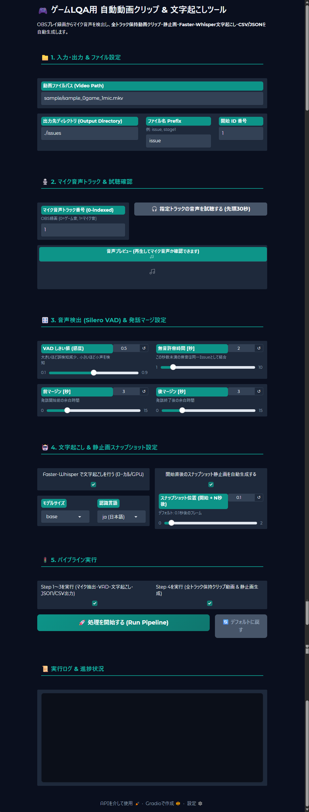
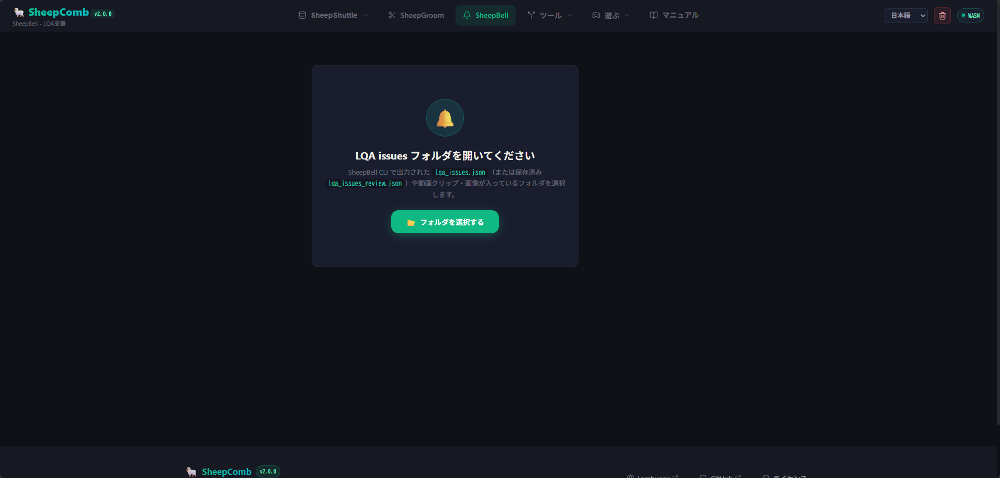

# SheepBell で LQA 記録を自動処理


**SheepBell** は、ゲームの LQA（Language Quality Assurance: ローカライズ品質検証）やデバッグプレイ中に録画された動画から、**テスターの発話区間（声を出して不具合を指摘した箇所）を自動検知**し、前後の動画クリップ・スナップショット画像・AI 文字起こし・構造化レポート（CSV / JSON / スプレッドシート）を一括生成するツールです。

出力されたデータは、[SheepBell ビューワ](https://lambuage.com/app/bell) を使ってブラウザ上で直接プレビュー、文字起こしの校正、レビューコメントの記入、レポートの出力まで一気通貫で行うことができます。

## 全体の流れ

SheepBell を使った LQA ワークフローは大きく以下の 4 ステップで進めます。

| ステップ | 内容 | 主なツール |
|:---:|:---|:---|
| **1. 録画の準備** | ゲーム音とテスターのマイク音声を別トラックに分けて録画します。 | OBS Studio など |
| **2. 処理の実行** | 動画から発話区間を検知し、クリップ切り出し・静止画・文字起こしを実行します。 | Google Colab / ローカル UI |
| **3. Web で確認・校正** | SheepComb の Web ビューワで動画・画像を見ながら、文字起こしを校正しコメントを追記します。 | SheepComb Web (/app) |
| **4. レポート出力** | 整った指摘一覧を CSV、JSON、Google スプレッドシート等で出力・共有します。 | SheepComb / Google Drive |

## 1. 録画環境の準備（OBS のマルチトラック設定）

SheepBell では、**「テスターの声」と「ゲーム・デスクトップの音声」を別々の音声トラックに分けて録画すること**を推奨しています。

音声トラックを分けておくことで：
- ゲーム中の効果音や BGM にテスターの声が埋もれて検知漏れするのを防ぐ
- ゲーム内のキャラクターボイスなどをテスターの発話と誤検知するのを防ぐ
- クリップ動画を出力する際、ゲーム音とマイク音のミックスバランスを保ったまま全トラック保持できる

といったメリットがあります。

### OBS Studio での設定手順

1. **[音声ミキサー]**（オーディオペイン）で歯車のアイコンをクリックし、**[オーディオの詳細プロパティ]** を開きます。


2. **マイク音声をトラック 2**、**ゲーム音声をトラック 1** のように別トラックへ割り当てます。このとき、不要なトラックのチェックは外しておきます。


::: tip トラック番号について
SheepBell ではマイク音声とゲーム音声のトラック番号を自由に指定できます。ご自身の環境に合わせて割り当ててください。
:::

3. **[コントロール]** ペインの **[設定]** を開きます。


4. **[出力]** タブの **[録画]** セクションを開き、**音声トラック** の欄で使用するトラック（例: 1 と 2）すべてにチェックが入っていることを確認します。


これで録画された動画ファイル（`.mp4` や `.mkv`）に両方のトラックが含まれるようになります。

::: tip 録画開始時のワンポイント
テスト開始時にマイクへ「〇月〇日、〇〇のステージテスト開始」などのメモ音声を短く吹き込んでおくと、後から音声トラックの判別が簡単になり、テスト動画のインデックスとしても役立ちます。
:::

## 2. プログラムの実行

SheepBell の処理エンジンは、**Google Colab（推奨）** または **PC のローカル環境** で実行できます。

### ☁️ Google Colab での実行（推奨・GPU 無料枠対応）

GPU（T4 等）を活用することで、長時間の動画でも高速に文字起こしと切り出しが完了します。

1. リポジトリで提供されている Colab ノートブック（または配布リンク）を Google Colab で開きます。
2. ランタイムのタイプを **「T4 GPU」** に設定します。
3. **「1. Google Drive のマウント」** を実行して Google Drive へのアクセスを許可します（録画動画の読み込みや成果物の自動保存がスムーズになります）。
4. **「2. リポジトリの準備」** セルを実行して必要なライブラリをインストールします。
5. **「3. Web UI の起動」** セルを実行すると、末尾に `Running on public URL: https://xxxx.gradio.live` という公開 URL が発行されます。このリンクをクリックして操作画面を開きます。
6. UI 上で処理が終わったら、Colab の **「4. 全成果物を Google Drive に保存 ＆ スプレッドシート自動作成」** セルを実行することで、切り出し動画・画像・自動生成された Google スプレッドシートが Drive に保存されます。

### 💻 ローカル環境での実行 (Windows / Mac / Linux)

ローカル PC に Python 3.10+ と [uv](https://github.com/astral-sh/uv) がインストールされている場合は、手元で実行することも可能です。

```bash
# 依存関係のセットアップ
uv sync

# Gradio UI の起動
uv run python app.py
```

起動後、ブラウザで `http://127.0.0.1:7860` にアクセスしてください。

## 3. SheepBell 操作画面とパラメータ設定

Web UI（Gradio）が開いたら、対象動画の処理を設定します。



### 基本設定

| 項目 | 説明 | デフォルト値 |
|:---|:---|:---:|
| **動画ファイルパス** | 処理したい動画ファイルのパスを入力します（Colab 実行時は Google Drive のマウントパス等を指定）。 | `sample/...` |
| **マイク音声トラック** | テスターの声が録音されているトラック番号（0 始まり。トラック 2 の場合は `1`）。 | `1` |
| **ゲーム音声トラック** | ゲーム音が録音されているトラック番号（トラック 1 の場合は `0`）。 | `0` |
| **全トラック保持・音声ミックス** | 切り出し動画にゲーム音とマイク音の両方を反映するかどうか。 | ON |
| **トラックプレビュー（30秒）** | 指定したマイク音声トラックの最初の 30 秒を試聴して、正しいトラックか確認できます。 | - |

### 命名・出力ルール

| 項目 | 説明 | デフォルト値 |
|:---|:---|:---:|
| **出力先ディレクトリ** | クリップや画像の保存先フォルダ。 | `./issues` |
| **ファイル名接頭辞 (Prefix)** | 生成されるファイルの名前（例: `stage1_001.mp4`, `bug_001.png`）。 | `issue` |
| **開始 ID 番号** | 連番の開始番号（複数動画を連番で処理したいときに便利）。 | `1` |

### 検知・文字起こしパラメータ

| 項目 | 説明 | 推奨値 |
|:---|:---|:---:|
| **VAD 閾値 (Silero VAD)** | 発話判定の感度。数値を上げると誤検知が減り、下げると小さな声も拾います。 | `0.5` |
| **無音マージ許容秒数** | 発話と発話の間の無音がこの秒数以内であれば、1 つの指摘（区間）として統合します。 | `2.0` 秒 |
| **前後マージン（秒）** | 発話の開始前・終了後に余裕を持たせる秒数。動画の前後の文脈を残せます。 | 前後 `2.0` 秒 |
| **文字起こし有効化** | Faster-Whisper による自動文字起こしを実行するかどうか。 | ON |
| **Whisper モデル** | 使用するモデルサイズ（`tiny` / `base` / `small` / `medium` / `large-v3`）。 | `base` または `small` |
| **言語選択** | 発話の言語（日本語 `ja`、英語 `en`、中国語 `zh`、自動検出 `auto` など）。 | `ja (日本語)` |
| **静止画スナップショット** | 発話開始＋0.1 秒付近の静止画（PNG）を自動生成するかどうか。 | ON |

### 処理の実行

1. **[音声プレビュー]** ボタンを押し、マイク音声トラックが正しいことを確認します。
2. 必要に応じてパラメータを調整します（基本はデフォルトのままで問題ありません）。
3. **[🚀 処理を開始する]** ボタンをクリックします。
4. 下部の実行ログに完了メッセージが表示されれば処理終了です。

## 4. 生成される成果物

処理が完了すると、指定した出力フォルダ（`./issues` など）に以下のファイルが一式生成されます。

```text
issues/
├── lqa_issues.json         # すべての指摘データ（タイムスタンプ、文字起こし、ファイル名）
├── lqa_issues.csv          # Excel / Google スプレッドシート互換の CSV (UTF-8 BOM)
├── issue_001.mp4           # 全音声トラックを保持した指摘箇所の動画クリップ
├── issue_001.png           # 指摘箇所のスナップショット画像
├── issue_002.mp4
├── issue_002.png
└── ...
```

## 5. Web ビューワでの確認・編集

生成された `issues` フォルダや `lqa_issues.json` は、[SheepBell ビューワ](https://lambuage.com/app/bell) で開いて活用できます。



1. フォルダを選択するをクリックし、上記の出力フォルダを選択します。
2. すると、発話をした場面とその周辺のクリップ・画像と、発話内容が一覧表示されます。
3. あとはクリップ・画像を見ながら、自分の発話内容を調整していけば完了です。
4. レビューコメントは自由記述です。今後、`#category: xxx`のように書くことで、Excel の列としてエクスポートする機能も開発予定です。
5. 確認が完了したら、更新された CSV や JSON をエクスポートし、そのまま開発チームやバグ管理ツールへ報告できます。

なお、SheepBell では一定時間ごとに、`lqa_issues_review.json` というファイルで選択されたフォルダに作業状況を自動保存しています。
また、`Ctrl + S` で手動の保存も可能です。

::: tip SheepComb エコシステムとの連携
SheepBell で作成した指摘やテキストは、SheepShuttle の用語集（TB）チェックや、SheepBobbin を経由した LLM チェックなど、他の Sheep ファミリーツールと組み合わせてさらに品質を高めることも可能です。
:::
