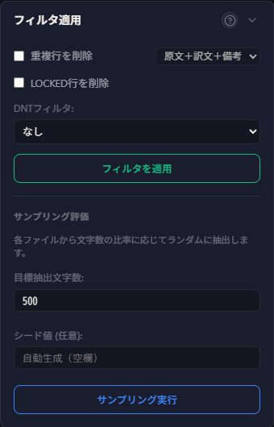
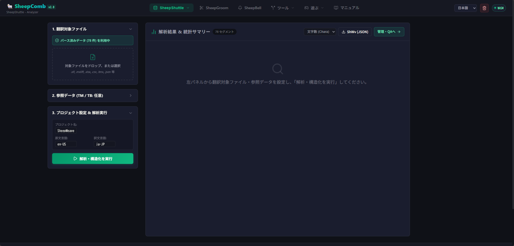
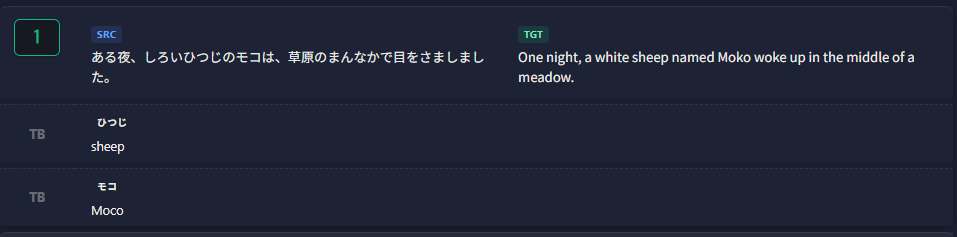
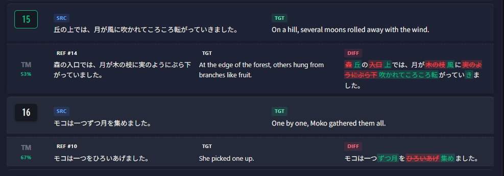

# SheepShuttle Bilingual Data Workflow

SheepShuttle provides comprehensive features for handling bilingual files within SheepComb. You can progress step by step through the top navigation menu.

| Step | Mode | Description |
|:---:|:---|:---|
| 1a | **Data Extraction** | Extract bilingual segments from XLIFF, TMX, TBX, Excel, and CSV files. |
| 1b | **Filter & Sampling** | Remove duplicate lines, locked segments, or DNT phrases, and generate randomized evaluation samples. |
| 2 | **Analysis & Structuring** | Cross-reference translation memories (TM) and termbases (TB) and calculate Weighted Word Counts (WWC). |
| 3 | **Data Management & QA** | Inspect matches, perform automated QA checks (numbers, tags, terminology), and export data. |
| 4 | **Build** | Re-inject adjusted bilingual data back into original XLIFF files. |
| 5 | **AI Request (API)** | Send chunked segments and tailored prompts to AI models for batch translation and verification. |

# Detailed Step-by-Step Guide

## 1a: Data Extraction

Start by extracting translation segments from your source files.

1. Select **Extract** from the menu.
2. Drag and drop your file into the top-left upload area, or click to browse.
3. Click the **Run Extraction** button.

::: tip Line Breaks in Cells
When extracting from Excel or XLIFF containing internal line breaks, segments are split by line break by default. Uncheck "Split by line breaks" if you prefer keeping cells intact.
:::

::: info Supported Formats
- **XLIFF Formats**: `.xliff`, `.xlf`, `.sdlxliff`, `.mxliff`, `.mqxliff`
- **TM & Glossaries**: `.tmx`, `.tbx`
- **Spreadsheets / Tables**: `.xlsx` (Col A: Source, Col B: Target, Col C+: Notes), `.csv`, `.tsv`, Word tables, JSON/JSONL
:::

### Volume Counts & Export
Above the table, approximate character and word counts are displayed. Click **Chara** or **Word** to switch metrics. Use the **CSV** or **JSON** buttons at the top right to download extracted data.

## 1b: Data Exclusion & Filtering

After extraction, the **Action Card** reveals **Filter** and **Sampling** options.

| Feature | Description |
|:---:|:---|
| **Remove Duplicate Rows** | Automatically eliminates identical source-target pairs beyond the first occurrence. |
| **Remove LOCKED Rows** | Excludes locked segments (available for `.mxliff` / `.mqxliff`). |
| **DNT (Do Not Translate) Filter** | Identifies and filters out non-translatable segments based on selected criteria. |

### Sampling Evaluation
For quality evaluations, extract representative subsets by specifying a target character count and random seed.

## 2: Analysis & Structuring

Convert extracted data into standardized project data (`ShWvData`), cross-referencing translation memories (TM) and termbases (TB).

1. Select **Analysis / Structuring** from the menu.
2. Add translation memory or glossary files if available.
3. Specify project metadata (Project Name, Source Language, Target Language).
4. Click **Run Analysis & Structuring**.

### Weighted Word Count (WWC)
Calculates workload metrics based on fuzzy match bands:

:::tip Supported TM & TB Formats
- **TM**: `.tmx`, `.xlf`, `.sdlxliff`, `.mxliff`, `.mqxliff`, `.csv`, `.xlsx`, `.json`, `.jsonl`
- **TB**: `.tbx`, `.xlf`, `.sdlxliff`, `.mxliff`, `.mqxliff`, `.csv`, `.xlsx`, `.json`, `.jsonl`
:::

## 3: Data Management & QA

### Visual Inspection
Inspect matching status with TB terms and TM entries directly in the table:

Click any record to inspect detailed match attributes:

### Automated QA Verification
Detect inconsistencies and errors across segments:

| QA Category | Description |
|:---|:---|
| **Number Mismatch** | Flags discrepancies in half-width Arabic numerals between source and target. |
| **Tag / Placeholder** | Verifies matching pairs of tags (`<>`, `{}`, `[]`). |
| **Termbase (TB) Consistency** | Checks if approved glossary translations are correctly used. |
| **Inconsistency (100% Matches)** | Flags identical source segments with differing translations. |
| **Unedited Post-Edit Leaks** | Detects unchanged draft translations where sibling segments were modified. |

### File Conversion & Export
Export project datasets or prepare chunked files for AI processing:

- **JSON Export / Import**: Save full project state (`.json`) or resume previous sessions.
- **AI Chunks**: Split by file boundary or specific character limits.
- **JSONL Export / Import**: Export for LLM pipelines and re-import completed outputs.

## 4: Build

Reconstruct translated bilingual files into CAT-ready formats (e.g., XLIFF):

Select the original bilingual XLIFF and the structured project dataset, then click **Start Build** to export XLIFF files with updated `<target>` tags.

## 5: AI (LLM) Integration

Integrate with [SheepBobbin](/en/docs/sheep-bobbin/) to run batch AI translation or linguistic verification.

1. Select **API** from the menu.
2. Enter the connection password to establish communication with SheepBobbin.

3. Click **Create Chunks** to divide dataset into manageable blocks.

4. Configure task parameters:
   - **Task Type**: `Check`, `Translate`, `Proof`, `Diff`, or `Custom`.
   - **Languages**: Replaces `{source_lang}` and `{target_lang}` in prompt templates.
   - **Prompt**: Customize instructions or load saved templates.
5. Click **Process All Chunks** to send requests sequentially.
6. Review AI findings and suggestions:

7. Click **Export CSV** to download results.

::: tip Re-running Single Chunks
Click the refresh button on individual chunk headers to re-execute single blocks.

:::

### Task Types Reference

| Type | Payload Contents | Recommended Use Case |
|:---|:---|:---|
| **Check** | `src`, `tgt`, `note` | AI translation review without TM/glossary noise |
| **Translate** | `src`, `note` | New translations or drafting from reference |
| **Proof** | `tgt` | Monolingual fluency check |
| **Diff** | `src`, tagged `tgt`, `note` | Revision evaluation |
| **Custom** | Customizable (`src`, `tgt`, `note`, `history`, `terms`) | Advanced contextual prompting |
