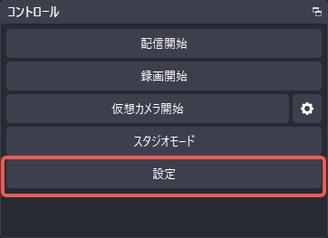

# Automated LQA Voice & Video Processing with SheepBell


**SheepBell** automatically detects **tester speech intervals (voice notes marking in-game bugs)** from gameplay and LQA recordings, extracting synchronized video clips, snapshot images, AI transcriptions, and structured reports (CSV / JSON / Google Spreadsheets).

Output results can be opened directly in the web-based [SheepBell Viewer](https://lambuage.com/app/bell) within SheepComb to preview media, proofread transcriptions, add review comments, and export reports.

## Overall Workflow

| Step | Summary | Primary Tools |
|:---:|:---|:---|
| **1. Recording Setup** | Record gameplay audio and tester microphone on separate audio tracks. | OBS Studio, etc. |
| **2. Processing** | Detect speech intervals, cut video clips, take snapshots, and transcribe audio. | Google Colab / Local UI |
| **3. Web Review & Proofing** | Proofread transcripts, preview clips, and add issue comments in the web viewer. | SheepComb Web (/app) |
| **4. Report Export** | Export structured bug reports to CSV, JSON, or Google Spreadsheets. | SheepComb / Google Drive |

## 1. Recording Setup (OBS Multi-Track Configuration)

SheepBell recommends recording the **tester's voice** and the **game audio** on separate audio tracks.

This prevents game sound effects and BGM from masking tester voice notes and avoids false detections from character voiceovers.

### OBS Studio Configuration Steps

1. In the **Audio Mixer** pane, click the gear icon and select **Advanced Audio Properties**.


2. Assign **Mic Audio to Track 2** and **Game Audio to Track 1**, unchecking unused tracks.


3. Open **Settings** in the Controls pane.



4. In the **Output** tab under **Recording**, ensure all active audio tracks (e.g., 1 and 2) are checked.


::: tip Pro Tip
Recording a brief spoken intro (e.g., "Oct 10, Stage 3 LQA starting now") makes track identification and test indexing effortless.
:::

## 2. Running SheepBell

SheepBell runs on **Google Colab (Recommended)** or your **Local PC**.

### ☁️ Running on Google Colab (Free GPU Support)

1. Open the provided `colab_sheepbell.ipynb` notebook in Google Colab (set runtime to **T4 GPU**).
2. Run **Mount Google Drive** to access input recordings and save deliverables.
3. Run the installation and launch cells to start `app.py --share`.
4. Open the generated `https://xxxx.gradio.live` link.
5. After processing, run the post-processing cell to save clips, images, and an auto-generated Google Spreadsheet to Drive.

### 💻 Running Locally (Windows / Mac / Linux)

```bash
uv sync
uv run python app.py
```

Open `http://127.0.0.1:7860` in your browser.

## 3. UI Overview & Parameters


### Key Parameters

| Parameter | Description | Default / Recommended |
|:---|:---|:---:|
| **Video Path** | Path to the target video file. | `sample/...` |
| **Mic Track Index** | 0-indexed track number for tester microphone (Track 2 = `1`). | `1` |
| **Game Track Index** | 0-indexed track number for game audio (Track 1 = `0`). | `0` |
| **VAD Threshold** | Speech detection sensitivity (Silero VAD). | `0.5` |
| **Min Silence Duration** | Maximum silence interval to merge adjacent utterances. | `2.0` s |
| **Pre/Post Margin** | Padding duration added before and after speech in clips. | `2.0` s |
| **Whisper Language** | Language for Faster-Whisper transcription (`ja`, `en`, `zh`, `auto`). | `ja` / `en` / `zh` |
| **Snapshot Offset** | Time offset from speech onset for snapshot image. | `0.1` s |

## 4. Generated Deliverables

```text
issues/
├── lqa_issues.json         # Complete structured issue dataset
├── lqa_issues.csv          # Excel / Spreadsheet compatible CSV (UTF-8 BOM)
├── issue_001.mp4           # Multi-track video clip
├── issue_001.png           # Snapshot image
├── issue_002.mp4
├── issue_002.png
└── ...
```

## 5. Web Review & Report Editing

Open output files in the [SheepBell Viewer](https://lambuage.com/app/bell):


1. Click **Select Folder** and choose the `issues/` output directory.
2. Review synchronized video clips, snapshots, and transcriptions side by side.
3. Proofread transcribed text and add reviewer comments or severity ratings.
4. Export finalized CSV / JSON reports for bug trackers (Jira, Redmine, etc.).

*(Session progress auto-saves periodically to `lqa_issues_review.json` and supports manual saving via `Ctrl + S`.)*
