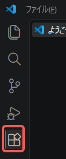
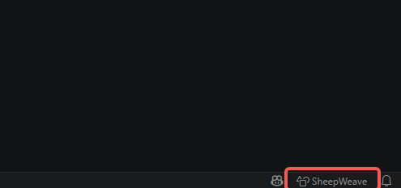

:::warning
This page is machine-translated by Gemini.
:::

# Getting Started

SheepWeave is a new Computer-Assisted Translation (CAT) tool designed to bring the best features of modern code editors into translation workflows.

Modern programming editors—often called Integrated Development Environments (IDEs)—integrate dozens of tools into a seamless workspace. They color-code text, provide context-aware auto-completion, offer fully customizable keybindings, and effortlessly wrap selected text in brackets or tags.

Furthermore, modern IDEs come with built-in AI capabilities. Beyond side-by-side chat panels, AI adjusts text dynamically based on surrounding context. For example, if you translate "not more than 1%" as "less than 1%", similar phrases can be transformed with a single `Tab` key. This is especially powerful for post-editing—turning passive voice into active voice or adjusting tone throughout an entire document.

It is a pity to reserve such powerful IDE features exclusively for programming. SheepWeave was created to give translators an editor that feels natural to both traditional Office users and seasoned CAT tool veterans.

***

# Installation

## 1. The Code Editor

SheepWeave is developed as an extension for Visual Studio Code (VS Code).

To use it, you need to install VS Code or one of its derivative IDEs (Cursor, Windsurf, Antigravity IDE, TRAE, etc.). All of them are free and available across Windows, macOS, and Linux.

::: tip Download Links
- [VS Code](https://azure.microsoft.com/products/visual-studio-code)
- [Cursor](https://cursor.com/)
- [Windsurf](https://windsurf.com/)
- [Antigravity IDE](https://antigravity.google/)
- [TRAE](https://www.trae.ai/)
:::

### Optional: For Office File Translations

SheepWeave natively handles XLIFF formats (mxliff, sdlxliff, etc.).
To translate Word or Excel files directly, you will need **Okapi Framework** and **Java** for format conversion.
Detailed instructions are covered in [Translating Actual Files](./03_actual_translation). We recommend trying standard XLIFF files first.

## 2. Extension Installation (`SheepWeave.vsix`)

### Install from VS Code Marketplace

From SheepWeave Ver 0.1.3 onwards, the extension is published on the Marketplace.
Click the Extensions icon in VS Code's left sidebar, search for `SheepWeave`, and click **Install**.

### Install from VSIX Package

If you are working offline or wish to install specific release builds:

::: tip Download
Download from <a href="https://storage.lambuage.com/#latest" target="_blank" rel="noopener noreferrer">this page</a>.
:::

Open VS Code Extensions (`Ctrl + Shift + X`), click the `...` menu at the top of the search bar, select **Install from VSIX...**, and choose the downloaded file.

## 3. Launching the Extension

Once installed, a new item named **SheepWeave** will appear in the bottom status bar.

Clicking it opens the main SheepWeave panel.

::: info Troubleshooting
If the button does not appear, open the Command Palette (`Ctrl + Shift + P`) and type **SheepWeave: Open Panel**.
If it still doesn't show, VS Code might be running in Restricted Mode. Click "Manage > Trust" on the bottom navigation.
:::

Installation is now complete! Let's proceed to the tutorial to experience lightweight, lightning-fast translation in a modern editor!
