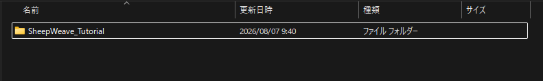
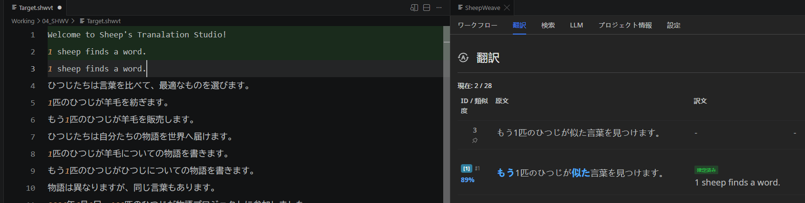
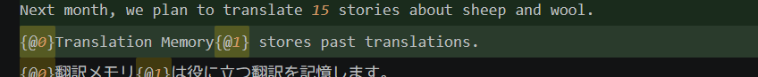

:::warning
This page is machine-translated by Gemini.
:::

# Tutorial (Hands-on Guide)

::: info macOS Users
For Mac users, please replace `Ctrl` with `Cmd` (`⌘`) and `Alt` with `Option` (`⌥`) throughout this guide.
:::

This tutorial walks you through experiencing SheepWeave's core CAT capabilities using a sample project.

## 1. Creating a Project Folder

Create an empty folder on your PC (e.g., `SheepWeave_Tutorial` in your Documents directory).

## 2. Placing Sample Files

Download sample files from <a href="https://storage.lambuage.com/#samples" target="_blank" rel="noopener noreferrer">here</a>. Extract the ZIP archive and move the `JSON` file into your project folder.

## 3. Opening in VS Code

1. Launch VS Code.
2. Select `File > Open Folder...` and open your project folder.
3. Click the **SheepWeave** icon in the bottom status bar to open the side panel.

## 4. Starting Translation

### Step 1: Extracting Project Assets

Open the **Workflow (Flow)** tab on the panel, choose **Experience** on the left menu, and click **Execute**.
This unpacks the project and generates folders including `04_SHWV` containing `Source.shwvs` (source text) and `Target.shwvt` (working translation file).

Double-click **`Target.shwvt`** to open it.

::: tip Recommended Layout
Split the editor into two columns (`Ctrl + 2`) so you can view `Target.shwvt` and the SheepWeave panel side by side. Toggle the file explorer with `Ctrl + B` for maximum screen space.
:::

### Step 2: Translating Segments

Switch the panel to the **Translate** tab (`Alt + 2`).
Place your cursor on line 1 of `Target.shwvt`. The source sentence will appear in the Translate panel.

Translate line 1 directly in the editor.

::: warning Fixed Line Count Rule
To preserve 1:1 segment correspondence, **adding or deleting line breaks is forbidden**. If you attempt to add or remove a line break, the editor automatically undoes it.
:::

Press **`Ctrl + Enter`** to **Confirm** the segment. Line 1 turns green, recording the segment pair and advancing your cursor to line 2.

### Step 3: Leveraging TM and Auto-Propagation

On line 2, observe the TM match area below the source display. It shows the translation from line 1 with diff highlights.
Press **`Ctrl + Shift + 1`** to apply the first TM suggestion directly into line 2! Adjust the diffs and confirm (`Ctrl + Enter`).

### Step 4: Handling Tags

When encountering inline tags like `{@0}`...`{@1}`, these represent formatting (bold, links, etc.). Preserve these tags around the corresponding target words so formatting is retained in the exported file.

Complete translating all lines and press **`Ctrl + S`** to save. Your translations are now reflected in `project.json`!
