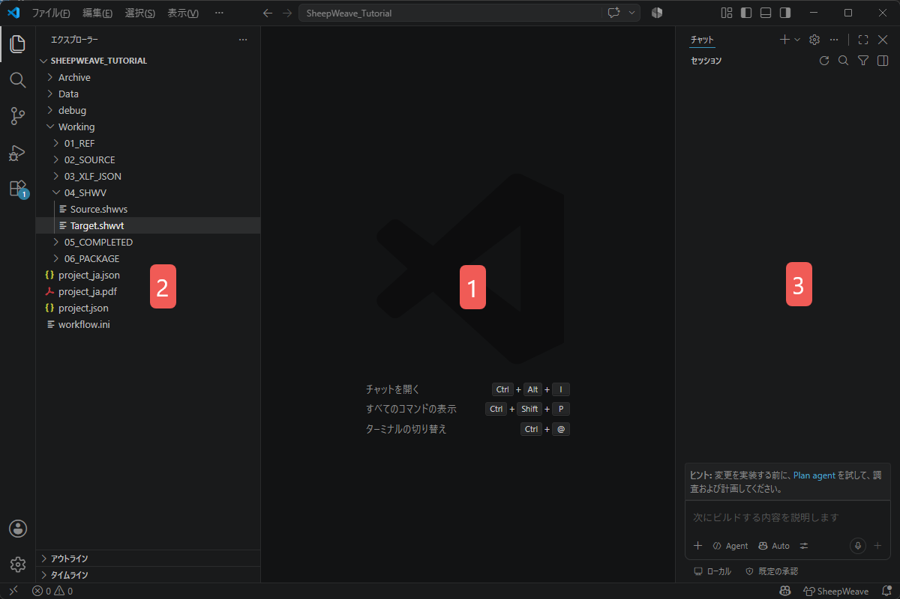

:::warning
This page is machine-translated by Gemini.
:::

# UI & Interface Overview

SheepWeave transforms VS Code into a high-productivity translation environment.
The standard layout consists of **Folder Tree on the left, Translation Editor in the center, and the SheepWeave Panel / AI Chat on the right**.

## VS Code Interface Elements

1. **Editor Screen (Center)**: Where you translate `Target.shwvt`. Numbers and tags (`{@0}`) are color-highlighted. Confirm lines with `Ctrl + Enter` (turns green). Line count is locked to prevent misalignments.
2. **Folder Tree (Left)**: Quick access to project files, `05_COMPLETED`, etc. Toggle with `Ctrl + B`.
3. **AI Chat (Right)**: Send text with `Ctrl + L` to standard chat or `Ctrl + Q` to the SheepWeave LLM tab.

## SheepWeave Panel Tabs (`Alt + 1` to `Alt + 7`)

### 1. Workflow / Flow (`Alt + 1`)
Manages the end-to-end lifecycle: Initialization, Preparation, Active Working, and Completion.

### 2. Translate (`Alt + 2`)
Your main translation console. Shows active segment source, up to 5 fuzzy TM match suggestions (insert with `Ctrl + Shift + 1..5`), and termbase (TB) hits with `Ctrl + Space` auto-completion.

### 3. Search (`Alt + 3`)
- **Concordance Search**: Cross-search corpora from source or target text.
- **Filter**: Filter segments within the current active file with live in-table editing.

### 4. Tools (`Alt + 4`)
- **Diff**: Visual difference comparison between TM suggestions and your active translation.

### 5. LLM (`Alt + 5`)
Batch or single-segment translation, post-editing, and QA via SheepBobbin.

### 6. Information (`Alt + 6`)
Project statistics, character/word counts, and progress percentages.

### 7. Settings (`Alt + 7`)
Adjust font size, UI themes, and manage custom auto-completion phrases (`phrase.jsonl`).
