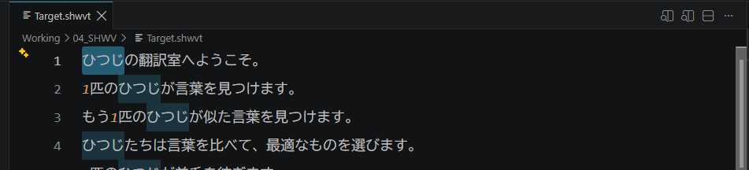
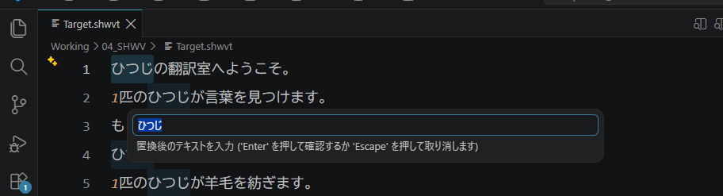
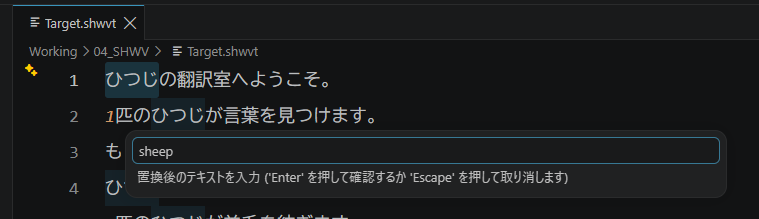

:::warning
This page is machine-translated by Gemini.
:::

# Guide to Simple Replace

Simple Replace is inspired by the convenient `F2 Rename` feature in modern programming IDEs.

Unlike ordinary text replacement, Simple Replace automatically records every replacement event into `01_REF/auto_replace_log.jsonl`.
This log serves as valuable **translation assets**—automatically functioning as termbases and auto-completion candidates in subsequent projects!

We strongly recommend actively leveraging Simple Replace when translating with SheepWeave.

## How to Use Simple Replace

1. Select the text you wish to replace.

2. Press **`F2`**.

3. In the popup input box, enter the replacement text and press **`Enter`**.

The change is applied across the entire file, and logged into `01_REF/auto_replace_log.jsonl`.

Press `Ctrl + Z` to undo if needed, or press `Esc` to cancel the input box.
