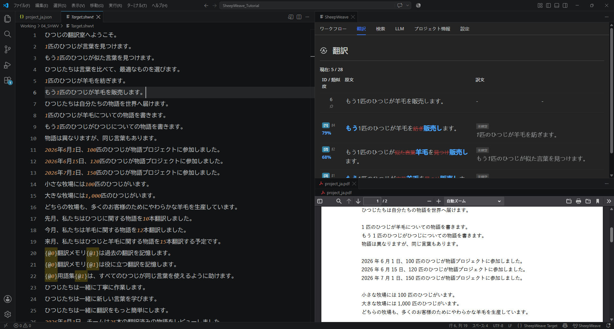

:::warning
This page is machine-translated by Gemini.
:::

# SheepWeave

A Computer-Assisted Translation (CAT) tool implemented as a Visual Studio Code extension.

The concept is **Weaving**.

Spinning threads of translation to weave beautiful, coherent fabrics of text.

## Key Features

- **Translation Memory & Termbase Integration**: Full core CAT functionality including fuzzy matching, TM leverage, and terminology recognition.
- **Blazing-Fast Search/Replace & Auto-Completion**: Plain-text architecture enables instant global replacements and seamless AI-assisted auto-completion.
- **100% Local Processing**: From parsing to editing, everything runs locally. As long as you have VS Code, it executes with ultra-low resource usage.
- **Cross-Platform**: Runs smoothly on Windows, macOS, and Linux, breathing new life even into older secondary laptops.

## User Guide

1. [Getting Started](./01_get_started)
2. [Tutorial (Hands-on Guide)](./02_tutorial)
3. [Translating Actual Files](./03_actual_translation)
4. [UI & Interface Overview](./04_interfaces)
5. [Shortcuts & Useful Features](./05_shortcuts_and_functions)
6. [Guide to Simple Replace](./06_simple_replace)
7. [Continuous Translation](./07_continuous_translation)
8. [LLM / AI Integration](./08_LLM_usage)
9. [Other Advanced Features](./09_other_usage)
10. [Multilingual Excel Translation & Rainbow](./10_rainbow)

## Reference

- [About CAT Tools](./11_about_cat)
- [VS Code Basics for Translators](./12_vscode_usage)
