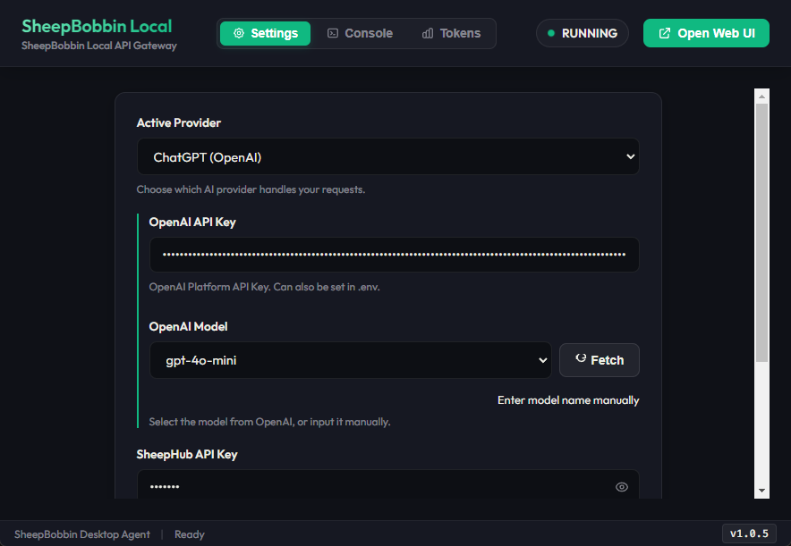
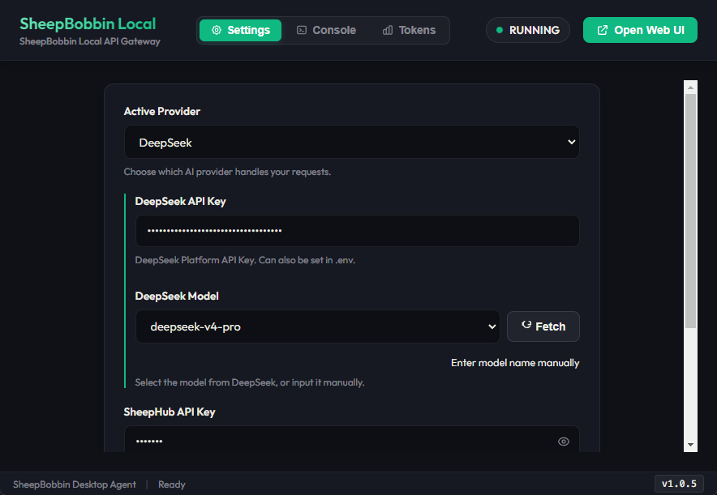

# クラウド LLM との通信
SheepBobbin は、各種クラウド LLM への通信もサポートしています。

## AI Studio（Google）の場合
AI Studio はブラウザで手軽に API キーを発行することができます。AI Studio に Google アカウントでログインしたら、右上にある API キーを作成 というボタンをクリックします。すると 新しいキーを作成する というポップアップウィンドウが表示されるので、分かりやすいキーの名前とプロジェクト名を入力します（プロジェクトは新規作成で OK です）。
プロジェクトが作成されれば、API キーが表示されますので、これをコピーして控えておいてください。その後、SheepBobbin の Active Provider で AI Studio を選択し、API キーを貼り付ければ OK です。
このとき SheepBobbin から AI Studio にそのとき使えるモデル一覧が問い合わせされます（もしくは手動で Fetch をクリック）。一覧が表示されていれば、通信は成功ですので、SheepCombWeb の画面に戻って処理ができるようになっています。

::: tip
AI Studio の API は無料版と有料版があります。作成した当初は無料版となっており、この場合は処理のために送信したデータが学習のために使用されることがあると明記されています。
一方で、作成した API キーの右の方にある お支払いを設定 から支払い情報を入力すると、その API キーは有料のものになります。有料版は基本的に学習に使用されません。
なお、AI Studio はクラウド側でキーが有料か無料かを判断しているため、SheepBobbin では有料・無料を問わず、アクティブな API キーを入力すれば処理が実行される仕組みになっています。
機密情報の処理などについては、細心の注意を払いつつ取り扱いください。
:::

## ChatGPT（OpenAI）の場合
OpenAI（ChatGPT）の API キーは [OpenAI Platform](https://platform.openai.com/) から発行できます。

1. [OpenAI Platform](https://platform.openai.com/) にアクセスし、OpenAI アカウントでログイン（またはサインアップ）します。
2. 左メニューの **API keys**（またはダッシュボード右上の設定メニュー内）を開きます。
3. **「Create new secret key」** ボタンをクリックします。
4. キーの名前（例: `SheepBobbin` など）を入力し、必要に応じて Project を指定して **「Create secret key」** をクリックします。
5. 生成された API キー（`sk-...` から始まる文字列）が表示されます。**この画面を閉じると二度とキー全体を確認できない**ため、必ずコピーして安全な場所に控えてください。
6. SheepBobbin の **Active Provider** で **ChatGPT**（または OpenAI）を選択し、API キー欄に貼り付けます。OpenAI Model の右側にある Fetch をクリックしモデル一覧（`gpt-4o`, `gpt-4o-mini` など）が表示されれば準備完了です。

::: tip
* **Web版サブスクリプション（ChatGPT Plus / Team等）との違い**:
  ChatGPT Plus（月額20ドル）等の有料プランに加入していても、API の利用料金とは別体系となります。API を利用するには、OpenAI Platform の **Settings > Billing** からクレジット残高の事前購入（チャージ：最低5ドル程度〜）が必要です。
* **データのプライバシー**:
  OpenAI の API 経由で送信されたデータは、原則としてモデルの学習（トレーニング）には利用されません。
:::

## DeepSeek の場合
DeepSeek の API キーは [DeepSeek Platform](https://platform.deepseek.com/) から発行できます。

1. [DeepSeek Platform](https://platform.deepseek.com/) にアクセスし、アカウント登録またはログインします。
2. 左メニューの **「API keys」** をクリックします。
3. **「Create API key」** ボタンをクリックします。
4. キーの識別名（例: `SheepBobbin`）を入力して作成します。
5. 発行された API キー（`sk-...` から始まる文字列）をコピーして控えます（※再表示はできません）。
6. SheepBobbin の **Active Provider** で **DeepSeek** を選択し、API キーを貼り付けます。利用可能なモデル（`deepseek-chat`, `deepseek-reasoner` など）が一覧表示されれば通信完了です。

::: tip
* **利用料金のチャージ**:
  DeepSeek API を利用するには、左メニューの **Top up** より少額のクレジット残高をチャージしておく必要があります。
* **データのプライバシー**:
  API 経由で送受信されるデータは学習に使用されません。
:::

::: warning
DeepSeek はベースとなる料金は安く設定されていますが、2026/9/8現在、初期設定では翻訳で多くのトークンを消費する傾向にあります。
この原因や必要な設定は検証中ですが、現時点では別のプロバイダー/モデルを検討することをお勧めします。
:::

## Claude（Anthropic）の場合
Claude の API キーは Anthropic の開発者向けコンソール [Anthropic Console](https://console.anthropic.com/) から発行できます。

1. [Anthropic Console](https://console.anthropic.com/) にアクセスし、アカウント作成またはログインします。
2. ダッシュボードの **「Get API Keys」** をクリックするか、右上のアカウントメニューから **API Keys** 画面を開きます。
3. **「Create Key」** ボタンをクリックします。
4. キーの名前（例: `SheepBobbin`）を入力し、**「Create Key」** をクリックします。
5. 発行された API キー（`sk-ant-...` から始まる文字列）をコピーして控えます（※再表示はできません）。
6. SheepBobbin の **Active Provider** で **Claude**（Anthropic）を選択し、API キーを貼り付けます。利用可能なモデル（`claude-3-5-sonnet`, `claude-3-5-haiku` など）が表示されれば完了です。

::: tip
* **Web版サブスクリプション（Claude Pro等）との違い**:
  Claude Pro の加入状況とは独立しており、API の利用には Anthropic Console の **Plans & Billing** よりクレジットの購入（チャージ）が必要です。
* **データのプライバシー**:
  Anthropic の商用 API 経由で送信されたデータは、モデルの学習には使用されません。
:::

## Vertex の場合
Vertex AI は Google のクラウドプラットフォームである GCP で提供されている PaaS（Platform as a Service）です。AI Studio と同じく Google のプロダクトではありますが、AI Studio が個人・小規模使用向けなのに対し、さらに強力な基盤のうえに構築されたエンタープライズレベルのパワーを持っています。
そのため、AI Studio よりも動作が安定しており、並行して複数のリクエストも対応可能となっています。

ただしその分、準備には Google Cloud Platform（GCP）のアカウント作成やプロジェクトの紐付け、クレジットカード情報の登録などが必要となります。設定手順がやや複雑なため、難しく感じる場合は、当社で提供を予定している共有アカウントのご利用をご検討ください。
