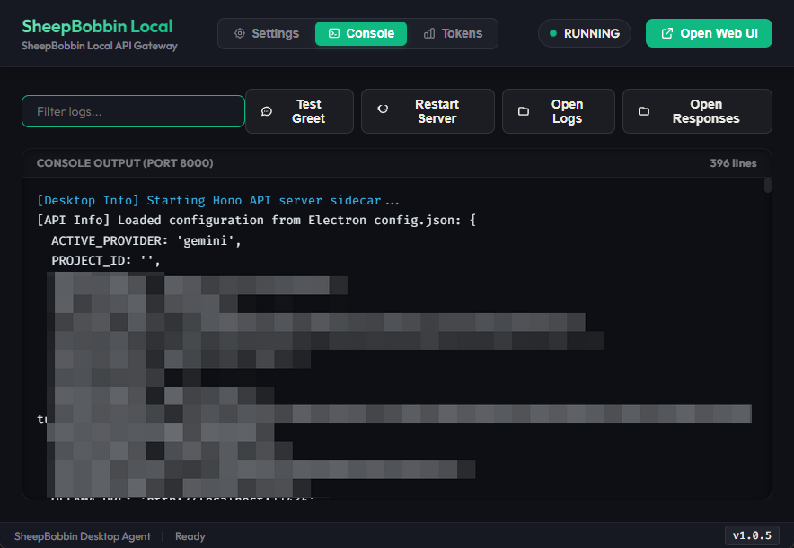

# SheepBobbin コンソールとログについて

SheepBobbin で上部にある **Console** をクリックすると、コンソール画面が表示されます。
この画面では、SheepCombWeb または SheepWeave から受け取ったリクエストや、AI からのレスポンスなどをリアルタイムで確認することができます。

::: tip コンソール出力の粒度
Settings の画面最下部にある **Enable Request Debug Logs** のチェックをオンにすると、通常のリクエストやレスポンスに加え、ヘッダーや所要時間などより細かな情報が表示・記録されるようになります。
:::

なお、このコンソールに表示された情報は、すべて server.log というファイルに保存されています。上部にある **Open Logs** をクリックすると、保存フォルダが開かれますので、デバッグや確認が必要な場合は、このファイルを確認してください。

また、リクエストや所要時間ではなく、AI からの回答のみを確認したい場合（接続が途中で切れてしまった、など）は、**Open Responses** をクリックしてみてください。ここにはレスポンスの内容が日ごとに JSONL 形式で保存されています。

# 消費トークンの記録について

クラウドの AI は通常、消費トークンによって料金が決まります。そのため、ある程度処理をしたら、トークンを確認したくなることでしょう。
その場合は、上部にある **Tokens** をクリックすると、消費トークンを確認できるようになっています。

消費トークンは日ごとにまとめられており、左側のメニューから選択することでプレビューできます。
また、消費トークンは tsv 形式で作成しているため、まとめて表計算ソフトなどでの集計も可能です。
プレビューではなく、ファイル自体を確認するには、**Open Tokens Folder** をクリックし、保存フォルダを開いてください。