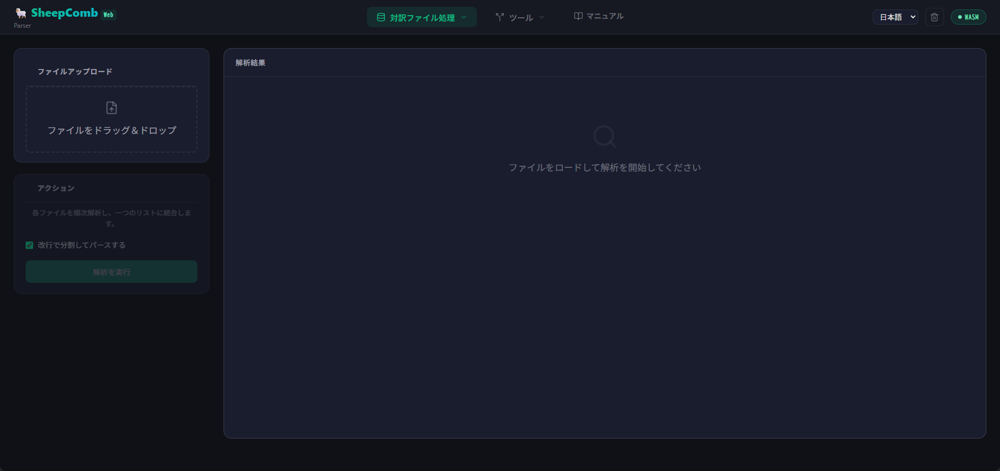

# 各ステップの詳細手順

## ステップ 1：データの抽出（抽出ページ）

最初に対象のファイルから翻訳データを抽出します。

1. メニューから「抽出」を選択します。
2. 画面左上のアップロードエリアに、処理したいファイルをドラッグ＆ドロップするか、クリックしてファイルを選択します。
3. **「解析を実行」** ボタンをクリックします。

::: tip
Excel や XLIFF でテキスト内に改行が含まれている場合、抽出時に改行で分割されます。
もしこの改行も保持したい場合は、「解析を実行」の上にある「改行で分割してパースする」のチェックを外してください。
:::

::: info 対応しているファイル形式
- **XLIFF 関連**：`.xliff`, `.xlf`, `.sdlxliff`, `.mxliff`, `.mqxliff` などの各種翻訳ツール用対訳ファイル
- **翻訳メモリ・用語集**：`.tmx`, `.tbx`
- **Excel/CSV**：`.xlsx`(A 列に原文、B 列に訳文、C 列以降にその他の情報), `.csv`, `.tsv`
- **その他**：Word の表、JSON / JSONL 形式のファイル
:::

解析が終わると、右側に原文・訳文・備考が一覧表示されます。

### 文字数の確認
一覧表の上には概算の文字数・単語数が表示されます。文字数（Chara）と単語数（Word）をクリックすると、表示を切り替えられます。
また、後述のフィルタやサンプリングでデータの項目数が減った場合も、リアルタイムで反映されます。

### ダウンロード
抽出したデータがファイルとして必要な場合は、右上にある CSV または JSON ボタンをクリックすることでダウンロードできます。
こちらも後述のフィルタやサンプリングでデータの項目数が減った場合、加工後のデータがダウンロードされます。

### 抽出したデータについて
なお、抽出したデータはブラウザ自体に保存され、次回開いたときにも保持されています（ただし、テキストベースで 5 MB 程度まで）。
ブラウザに残っているデータを消去したい場合は、右上にあるゴミ箱のアイコンをクリックしてください。

## ステップ 2：データの除外・絞り込み（フィルタ・サンプリング）

データを抽出すると、**アクション** のカードに **フィルタ** と **サンプリング** の項目が表示されます。

抽出したデータを目的に応じて加工することができます。

### フィルタ

指定した条件に合う行を減らす工程です。
不要な行を減らすことで、データサイズが軽くなり、後の処理も便利になります。
ただし、削除した行は元に戻せませんので、「重複も重要なデータ」である場合などは、慎重に行ってください。

フィルタには以下の3つの項目があります。

| 機能名 | 概要 |
| :---: | :--- |
| **重複行を削除** | 全く同じ原文と訳文のペアがある場合、2 件目以降を自動的に削除します。 同じと判定される条件について、原文・訳文・備考のどこまで一致している必要があるか、右側のドロップダウンで指定できます。 |
| **LOCKED 行を削除** | 編集不可としてロックされている行を除外します（mxliff/mqxliffからの抽出のみ）。 |
| **翻訳不要（DNT）フィルタ** | 翻訳する必要のない行を自動で判定して除外します。この機能を使うには、チェックを入れた上で、下部のDNTフィルタから除外対象を選んでください。 |

フィルタを適用した条件にチェックを入れたら、**フィルタ実行** をクリックします。
すると、右側の一覧からチェックを入れた行が除外されます。

### サンプリング評価

大量のデータから、一部だけを抜き出して品質テストを行いたい場合に使用します。

| 機能名 | 概要 |
| :---: | :--- |
| **目標抽出文字数** | 抽出したい目安の合計文字数を指定します。 |
| **シード値** | ランダム抽出の基準となる数値です。同じ数値を入れると常に同じ行が選ばれます（空欄にするとランダムに自動生成されます）。 | 

設定後、**「サンプリング実行」** ボタンをクリックすると、右側にサンプリング結果が表示されますので、CSV/JSON形式でダウンロードしてください。

## ステップ 3：統合と構造化（構造化ページ）

抽出・加工したデータを、システムが処理しやすい「プロジェクトデータ」へと変換・統合します。
このプロジェクトデータは ShWvData というスキーマを採用しており、VS Code 拡張型CATツール[SheepWeave](../sheepweave)で利用できます。
また、後述のLLM連携で高度な機能（過去訳や用語集も情報として渡す）を利用するには、いったん構造化と解析を行う必要があります。

構造化の手順は次のとおりです。

1. メニューから「構造化」を選択します。
2. 追加で他の対訳ファイルを読み込ませたい場合は、アップロードエリアにファイルをドロップします。
3. プロジェクトの基本情報を入力します。
 - **プロジェクト名**：わかりやすいプロジェクト名を入力します。
 - **ソース言語**（原文の言語）：英語、日本語、中国語などから選択します。
 - **ターゲット言語**（訳文の言語）：翻訳先の言語を選択します。
4. **「構造化を実行」** ボタンをクリックします。

::: tip
構造化が完了すると、自動的に次の「解析」ステップへデータが引き継がれます。
:::

## ステップ 4：翻訳メモリと用語集の照合（解析ページ）

構造化ができると、続いて解析を行うことができます。

解析では過去の翻訳データ（翻訳メモリ/TM）や、決まった訳し方を指定する（用語集/TB）をデータに適用できます。
TMやTBがない場合でも、抽出したデータ内での類似度を計測できます。

解析が完了すると、類似度の区分に応じた負荷割合を設定し、文字数として可視化できます（WWC）。

解析の手順は次のとおりです。

1. メニューから「解析」を選択します。
2. 以下のエリアに対応するファイルをドラッグ＆ドロップします。
 - **翻訳メモリ(TM)**：過去の対訳データ（`.csv` または `.tmx`）
 - **用語集(TB)**：専門用語や指定訳のリスト（`.csv` または `.tbx`）
3. **「解析を実行」** ボタンをクリックします。

これにより、各行の原文と一致する用語や翻訳メモリがあるかどうかが照合され、AI 処理時にコンテキストとして利用できるようになります。

## ステップ 5：データの分割と管理（管理ページ）

作成したプロジェクトデータを保存したり、AI に送るための前準備を行います。
この手順は、SheepWeave との連携がメインなので、飛ばしても問題ありません。

- **プロジェクトデータの保存・復元**
 - **データの書き出し**：現在のプロジェクト全体を本システム専用の形式（`.json`）や、Excel 等で開ける `.csv` 形式でダウンロードし、PC に保存できます。
 - **データの読み込み**：以前保存した `.json` ファイルをドロップすれば、いつでも前回の作業状態を再現できます。

- **AI 向けの分割（チャンク化）**
 AI は一度に大量の文章を処理すると精度が下がったり、エラーになったりします。そのため、適切な長さでデータを小分け（チャンク化）します。
 - **ファイル単位で分割**：元のファイルごとにデータを分けします。
 - **指定文字数で分割**：設定した文字数（例: 5000 文字）ごとに自動で均等に分割します。

- **JSONL 形式での書き出し・取り込み**
 - AI 処理用に `.jsonl` 形式で出力できます。また、AI 処理済みの `.jsonl` を読み込んで、結果を本システムに反映（上書き）することも可能です。

## ステップ 6：AI(LLM)への依頼（API ページ）

デスクトップアプリ（SheepBobbin）と連携し、AI へ翻訳やチェックを一括で依頼します。

::: warning 準備
AI へのリクエストを行うには、あらかじめデスクトップアプリ「SheepBobbin」が起動しており、AI の接続設定（API キーの入力やローカルモデルの起動）が完了している必要があります。詳細は[SheepBobbin](/sheep-bobbin/)をご確認ください。
:::

::: tip チャンクとは？
「チャンク」とは、AI に一度に処理させるために小分けにされたデータの塊のことです。
AI（LLM）には一度に処理できるテキストの量（コンテキストウィンドウ）に限界があり、大量のテキストを一度に送信すると「指示を忘れる」「処理の精度が落ちる」「エラーになる」といった問題が発生します。
本システムでは、データを適切な文字数の「チャンク」に分割し、AI へ順番に送信することで、高い精度と安定した処理を実現しています。
:::

1. メニューから「API」を選択します。
2. **接続パスワード** を入力し、デスクトップアプリとの通信を確立させます。
3. **「チャンク作成」** をクリックし、データを小分けにします。
4. 依頼する内容を設定します。
  - **処理タイプ**：翻訳、チェックなどの処理目的を選択します。
  - **出力キーの選択（CUSTOM）**: 処理タイプで「CUSTOM」を選択すると、AI に送信するデータの中にどの項目を含めるかを個別に選択できます（`src`：原文、`tgt`：訳文、`note`：メモ、`history`：履歴、`terms`：用語集）。不要な情報を除外することで、**AI のトークン消費（利用料金）を節約**し、余計なノイズを減らして**処理の精度を高める**ことができます。
  - **プロンプト**：AI への具体的な指示文です。
  - **プロンプトの読み込み（📤ボタン）**: パソコンに保存してあるテキストファイル（`.txt` や `.md`）から、独自の指示文を直接アップロードして反映できます。
  - **プロンプトのリセット（🔄ボタン）**: 編集したプロンプトを、システム標準のデフォルト状態にワンクリックで戻すことができます。
5. **「全チャンク処理」** ボタンをクリックすると、小分けにされたデータが順番に AI へ送信され、処理が実行されます。
6. 処理が終わったら、**「CSV エクスポート」** をクリックして結果をダウンロードします。「訳文だけ出力」にチェックを入れると、翻訳後のテキストのみを取り出すことができます。
