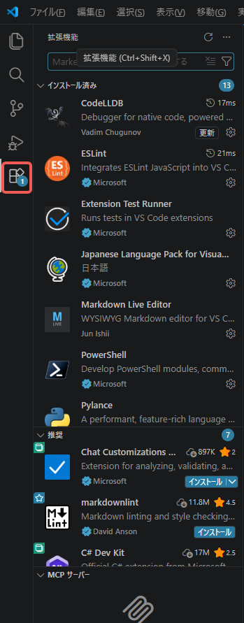
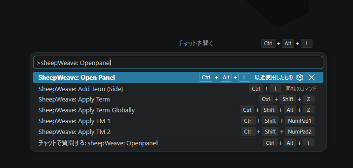
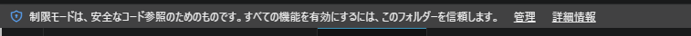
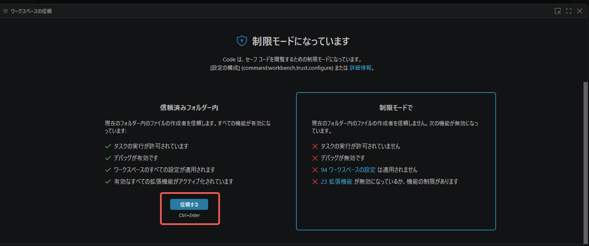

# はじめに

SheepWeave はプログラミングエディタのいいとこ取りを目指した、新しい翻訳支援ツール（CAT ツール）です。

最近のプログラミングエディタは、統合開発環境（IDE）とも呼ばれていますが、その名のとおり様々なツールが統合されて使いやすくなっています。特定のテキストに色をつけたり、文脈に合わせた入力候補を表示したりといったことが可能です。ほかにも自分用のショートカットやキーバインドをつくることもできますし、「選択中の部分を括弧で囲む」ような処理も得意です。

さらに昨今では、AI 機能が標準搭載。すぐ横のチャット欄でやり取りするのはもちろん、編集中も前後の文脈にあわせて調整してくれることもあります。たとえば、not more than 1%を 1%未満に翻訳すると、同じようなフレーズをタブだけで変換していくことも可能です。この機能が力を発揮しやすいのがポストエディット。能動態を受動態に書き換えるのもサポートしてくれますし、「全編を敬語に」といったことも可能です。

こんな便利な機能が満載の IDE を、プログラミングだけで使うのはもったいない。その思いから始まっているのがこの SheepWeave です。これまで Office などで上書き翻訳していた人にも、CAT ツールをよく使っていた人にも馴染みやすいエディタを目指しています。

***

# インストール
## エディタ

SheepWeave は Visual Studio Code（VS Code）をベースに、拡張機能として開発をしています。

そのため使用するには VS Code かその派生製品（Cursor/Windsurf/Antigravity IDE/TRAE など）をインストールする必要があります。

いずれも OS を問わず、無料でインストールできます。

::: tip ダウンロード URL
-[VS Code](https://azure.microsoft.com/ja-jp/products/visual-studio-code)
-[Cursor](https://cursor.com/)
-[Windsurf](https://windsurf.com/)
-[Antigravity IDE](https://antigravity.google/)
-[TRAE](https://www.trae.ai/)
:::

### オプション（Office ファイル等の翻訳用）

SheepWeave は単体で XLIFF（mxliff, sdlxliff 等）を翻訳できます。
もし Word や Excel などの Office ファイルを直接翻訳したい場合は、ファイル変換を行うために「Okapi Framework」と「Java」が必要になります。
詳細な手順は「[実際のファイルの翻訳](./03_actual_translation)」の章で解説しますので、まずは XLIFF ファイルの翻訳から試していただくのがおすすめです。

## 拡張機能（SheepWeave.vsix）

SheepWeave を VS Code にインストールするためのファイルです。分かりやすいところに保存しておいてください。

::: tip ダウンロード
<a href="https://storage.lambuage.com/#latest" target="_blank" rel="noopener noreferrer">こちら</a>から（最新は Ver 0.1.0）
:::

続いて、VS Code に拡張機能をインストールします。
[表示]>[拡張機能]（または `Ctrl + Shift + X`）と進むと、左側に拡張機能の一覧が表示されます。

ここで最上部の検索ボックスの右側にある ... をクリックし、[VSIX からのインストール...]をクリックします。

すると、ファイル選択ダイアログが出るので、上記の vsix ファイルを選択します。
これで拡張機能のインストールは完了です。

## 拡張機能の起動

拡張機能のインストールができると、右下のナビゲーションバーに「SheepWeave」という項目が増えています。

これをクリックすると、SheepWeave の基本パネルが立ち上がります。

::: info
上記の項目が表示されない場合は、Ctrl+Shift+P でコマンドパレットと呼ばれるものを開き、**SheepWeave: Open Panel** と入力してみてください。

この項目も表示されない場合は、VS Code が制限モードで動作している可能性があります。

このようなナビゲーションがあれば、[管理]>[信頼する]と選択してください。

:::

これでインストールは完了です！
まずはチュートリアルを通じて、エディタによる軽量な翻訳を体験してみましょう！