# チュートリアル（基本体験編）

::: info
Mac をご利用の方は、本マニュアル内の `Ctrl` キーを `Cmd`（`⌘`）キー、`Alt` キーを `Option`（`⌥`）キーに読み替えてご操作ください。
:::

この章では、サンプル用ファイルを通じて、CAT ツールとしての機能を簡単に体験することを目的としています。
CAT ツールについて、詳しく知りたい方は[こちら](./11_about_cat)をご覧ください。

## プロジェクトフォルダの作成

まずは、翻訳を行うための空のフォルダを作成します。PC 上の分かりやすい場所（ドキュメントなど）に、新しいフォルダ（`SheepWeave_Tutorial`など）を作成してください。

## サンプルファイルの配置

サンプルファイルは<a href="https://storage.lambuage.com/#samples" target="_blank" rel="noopener noreferrer">こちら</a>で配布しています。お好きな元言語のファイルを選択してダウンロードしてください。
その後、ダウンロードした zip ファイルを展開し、その中にある `JSON` ファイルを、上記で作成したプロジェクトフォルダに移動しておきます。

## 起動とフォルダを開く

1. VS Code を起動します。
2. \[ファイル]> \[フォルダーを開く...]と進み、先ほど作成したプロジェクトフォルダを選択して開きます。
3. ウィンドウ右下にある「SheepWeave」とあるアイコンをクリックして、SheepWeave のパネルを開きます。

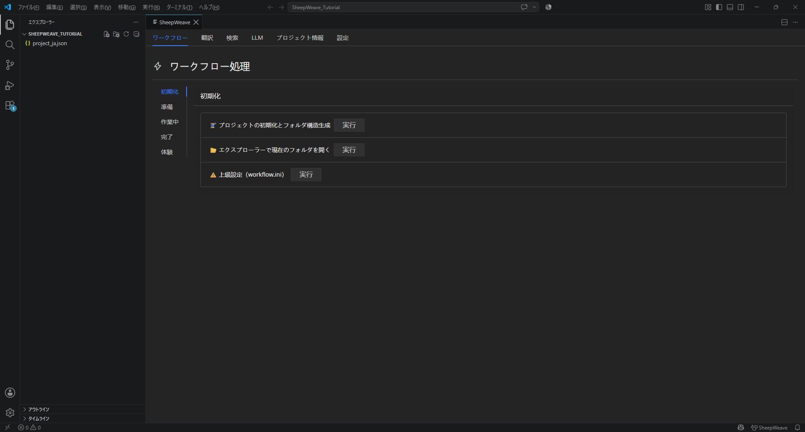

これで準備は完了です。

## 翻訳の開始

### 1. プロジェクトの展開

サンプルファイルは下図のような`JSON`と呼ばれる形式になっています。

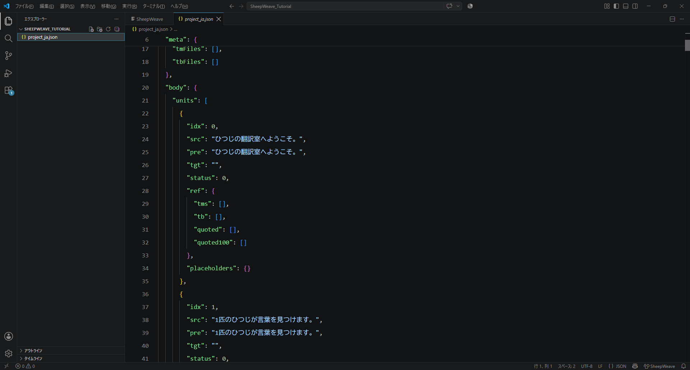

ここから翻訳用のファイルを生成します。

パネルの **ワークフロー** タブを開き、左のナビメニューで、**体験** を選択します。

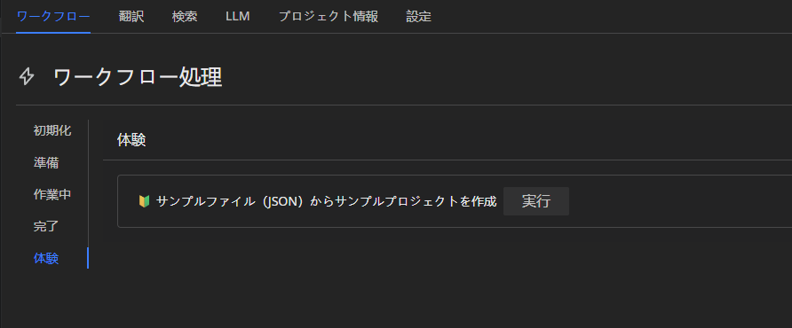

その後、実行ボタンを押すと、プロジェクトファイルが展開され、各種フォルダとファイルが作成されます。

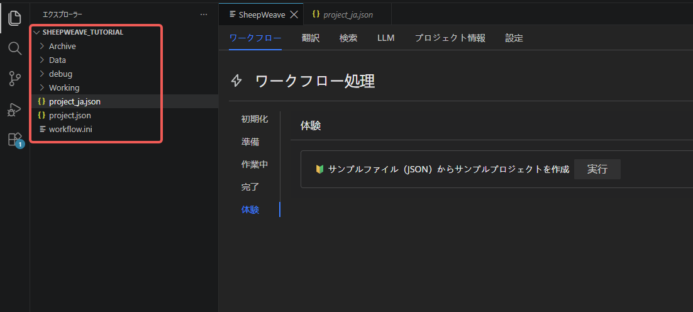
これらのフォルダのうち、チュートリアルで説明するのは **04_SHWV** のみです。中身を確認すると、**Source.shwvs** と **Target.shwvt** という 2 つのファイルが作成されています。その名のとおり、**Source.shwvs** が原文で、**Target.shwvt** が翻訳を進めていくためのファイルです。

さっそく **Target.shwvt** をダブルクリックして開きましょう。

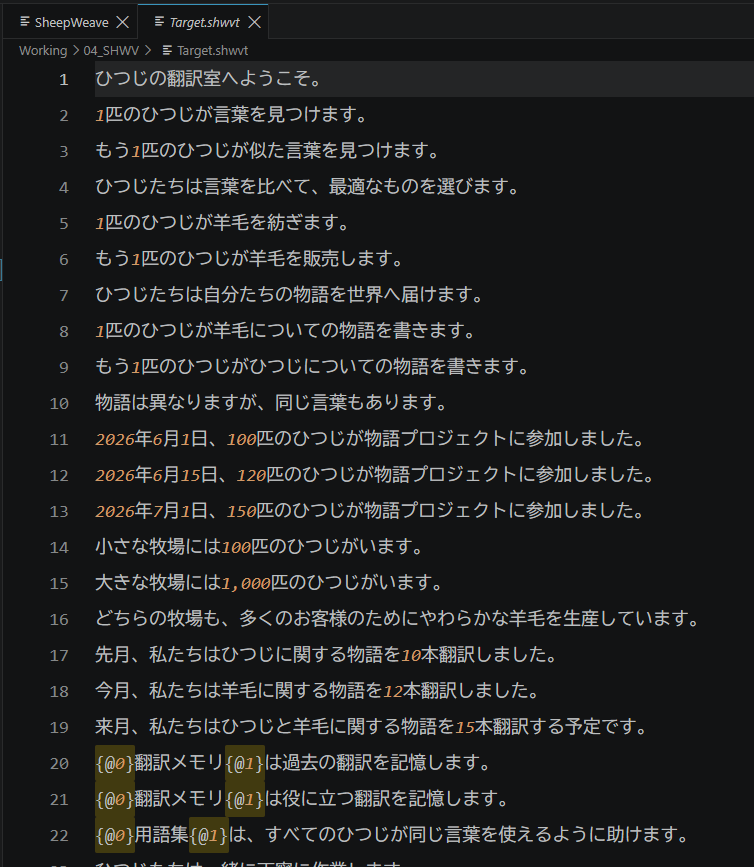

このファイルを翻訳していくことになります。
初期状態では、翻訳が進んでいないため、**原文がコピー** されている状態です。これを上書きで翻訳していき、すべて翻訳が終われば完了となるのが、基本の流れです。

::: tip レイアウトについて
VS Code はエディタウィンドウを上下左右に分割して表示できます。
翻訳作業では、ビューを左右に分割してパネルと **Target.shwvt** を同時に表示しながら進めるのがおすすめです。
`Ctrl + 2` を押すと画面が左右に分割されますので、空いている方のビューをクリックしてから**Target.shwvt** を開くとうまく表示されます。

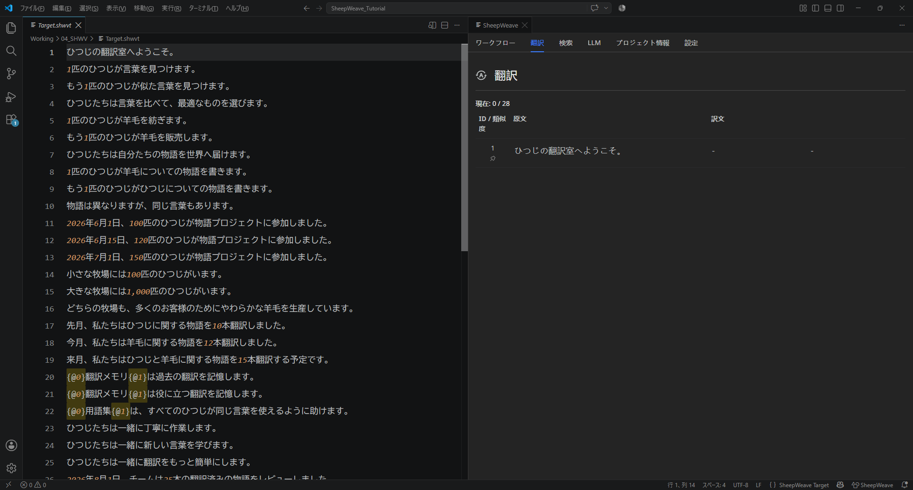

表示スペースはドラッグで自由に入れ替えられるので、自分に合ったレイアウトを探してみてください。
また、**Target.shwvt** を開いた後は、左右のペインを非表示にすると作業領域を広く確保できます。左側のエクスプローラーペインは `Ctrl + B` で、右側のチャットペインは `Ctrl + L` で表示/非表示を切り替えできます。

詳細は[こちら](./12_vscode_usage)でも解説しています。
:::

### 2. エディタの準備～最初の翻訳

翻訳を始めるにあたり、まずはパネルの表示項目を **翻訳** にします。
表示ができたら、**Target.shwvt** に戻りましょう。
**Target.shwvt** の 1 行目にカーソルを合わせると、パネル側に原文が表示されます。

ここで、カーソルを 2 行目に移動させてみましょう。すると、パネル側の原文表示も 2 行目の内容に変わることが分かると思います。

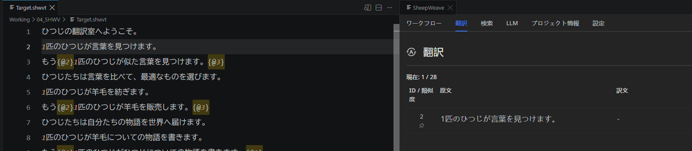

**Target.shwvt** は上書きで翻訳を進めていきますが、**Translate** のタブには翻訳対象の原文が常に表示されますので、あとからでも戻って確認できるようになっています。

原文の表示が確認できたら、1 行目を翻訳してみましょう。VS Code のエディタ画面は基本的にメモ帳と同じなので、そのまま上書きで翻訳していくことができます。

::: warning 改行の追加・削除の禁止について
原文との対照性を損なわないため、**行数の変更はできないようになっています**。
改行の追加や削除をしようとすると、Undo されますのでご注意ください。
行数が変わらない状態の貼り付け（たとえば 3 行分を選択して、3 行分の訳文を貼り付けるなど）は問題なく行えます。
:::

1 行目の翻訳ができたら、**確定** をします。
1 行目の任意の場所にカーソルがある状態で、Ctrl + Enter を押してください。すると、1 行目の背景色が緑色に変わります。**確定** をすると、このように表示色で「どこが翻訳済みでどこが未翻訳か」が分かりやすくなるだけでなく、原文と訳文のペアが記録され、後から参照しやすくなります。

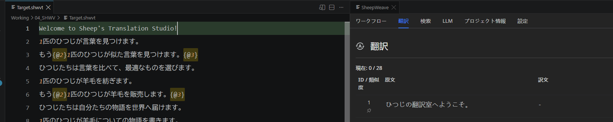

### 3. 2 行目以降の翻訳

**確定** をすると、カーソルが次の行に移ります。同時に、Translate タブの原文表示も切り替わります。

このまま 2 行目も翻訳して、確定しておきましょう。

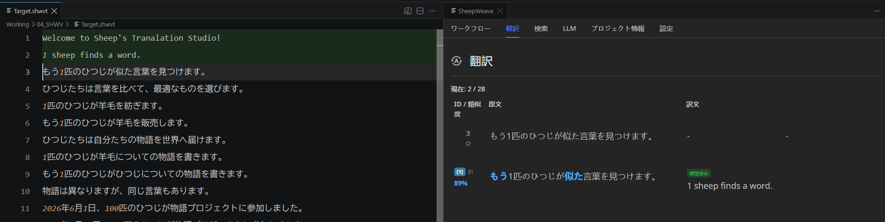

1 行目と 2 行目の原文は似たものであることに気づくと思います。

ここで原文表示の下にある内容を見てください。先ほど翻訳した 1 行目の原文（差分つき）と訳文が表示されています。
これは一定以上似た原文があった際に、「**どこがどう変わったか**」と「**似た原文はどのように訳されたか**」を表示する CAT ツールの基本機能です。

これを見ながらもう一度翻訳してもいいのですが、せっかくなので以前の訳文をそのまま貼り付けてみましょう。`Ctrl + Shift + 1` を押してみてください。すると、一番上に表示されている訳文が、現在の行に適用されます。

あとは差分を見ながら、修正の必要な部分を反映していけば OK です。この調子でどんどん翻訳を進めていきましょう。

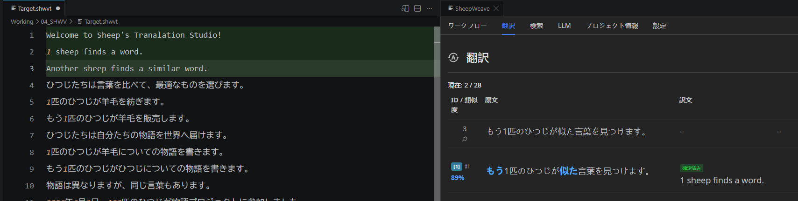

### 4. タグの処理

翻訳を進めていくと、{@0}～{@1} という特殊な記号に遭遇します。これは書式（太字、フォントカラーなど）や HTML タグ（リンクなど）を一時的に変換しているものです。実際にサンプルファイル内に含まれている Word ファイル（または PDF ファイル）を開くと、この箇所は **太字**になっています（下図参照）。

この構造を壊さないように翻訳することで、出力時にも同じ場所が **太字** になるようにできます。
この行の翻訳ではタグを残したまま翻訳して、確定してください。

なお、構造の保持は「**{@x}で囲まれた要素が原文と訳文で同じになるようにする**」という意味であり、必ずしも「**原文の{@x}が文頭にあるから訳文の{@x}も文頭に置く**」というわけではありません。たとえば、下図のように翻訳しても問題なく「用語集」に相当する部分が太字として翻訳されます。

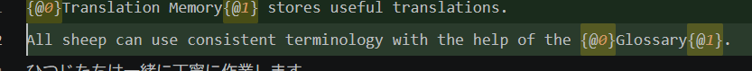

このまま最後まで翻訳していきましょう。

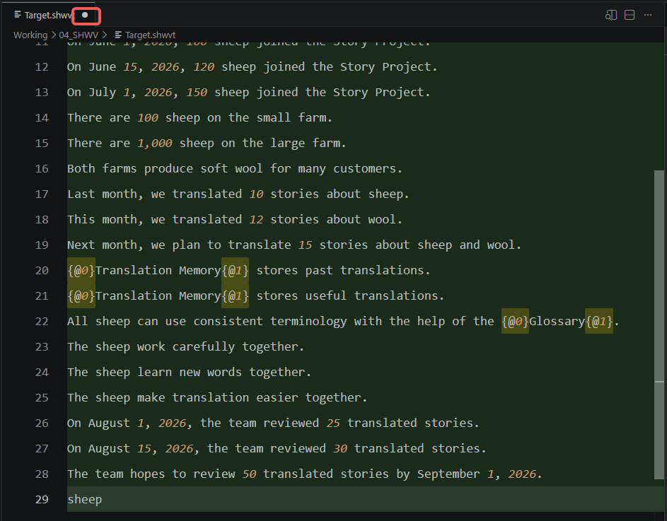

すべての行の翻訳が終わりました。
このとき、少し注意していただきたいのが、**Target.shwvt** というタブの部分についているポッチです。

これは「**このタブのファイルには未保存の変更が含まれていますよ**」ということを示しています。
Ctrl + S で保存して完了です。

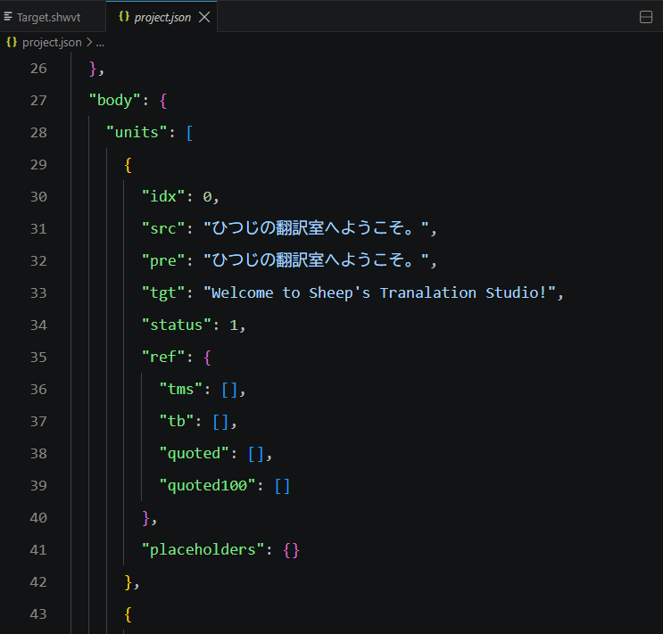

最初にお見せした `project.json` を開いてみると、訳文が反映されていることが分かります。

---

以上が、SheepWeave の最も基本的な使い方です。
テキストエディタの形式を利用しているため、軽快に動作するのがお分かりいただけたかと思います。
もちろん、実務ではこのチュートリアルで使用した JSON ファイルを元原稿として使うことはほとんどありません。
これはあくまで、SheepWeave で使用することを想定したフォーマットとなっているからです。

それでもご安心ください。SheepWeave は、業界標準である XLIFF 系ファイル（XLIFF/SDLXLIFF/MXLIFF/MQXLIFF）や、Word/Excel/PPT などの Office ファイルも、この JSON 形式に変換して翻訳し、元のファイルに戻すところまでサポートしています。詳細は次の「[実際のファイルの翻訳](./03_actual_translation)」をご覧ください。
