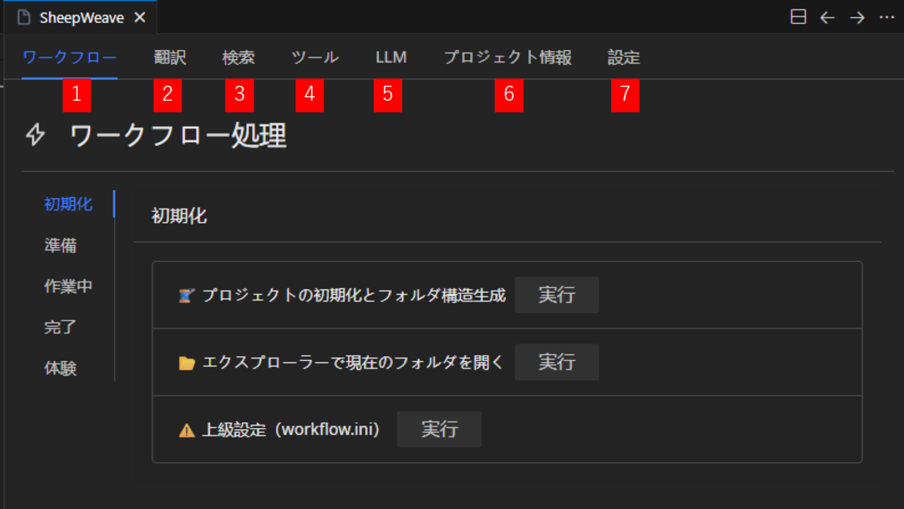
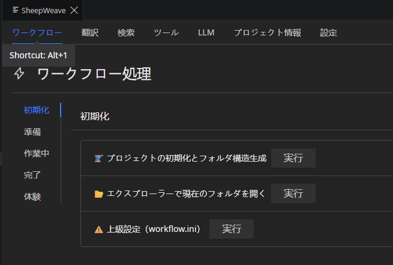
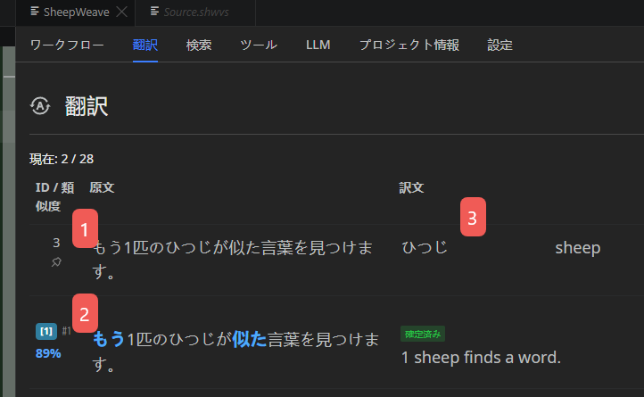
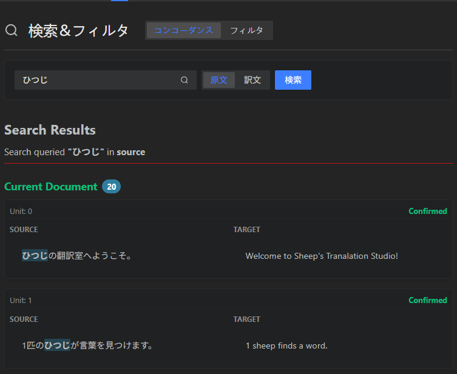
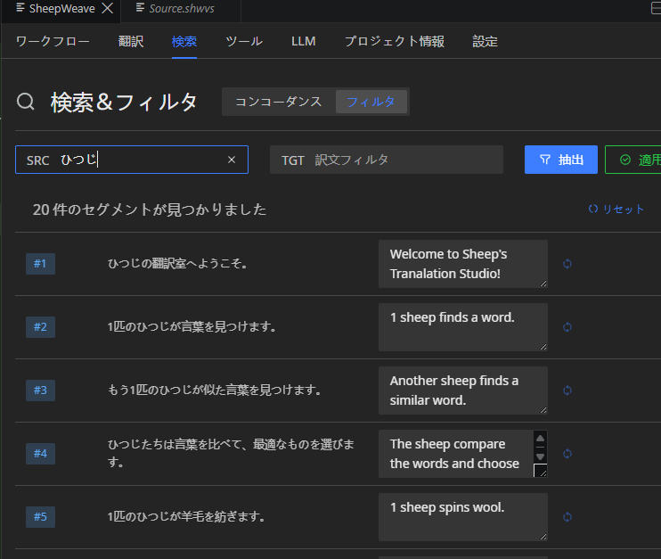
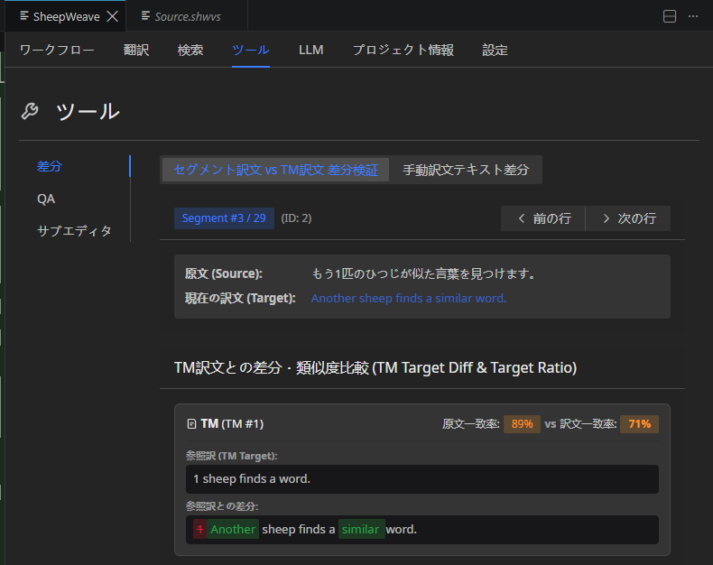
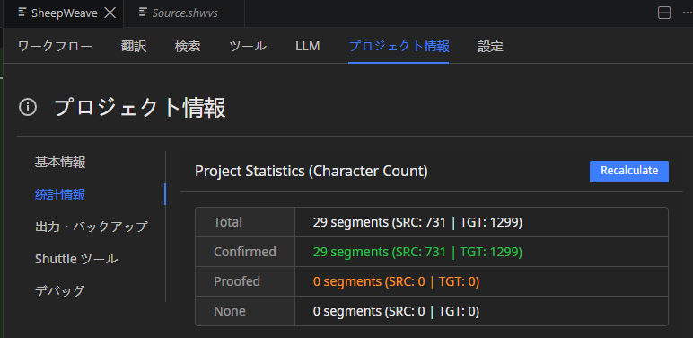
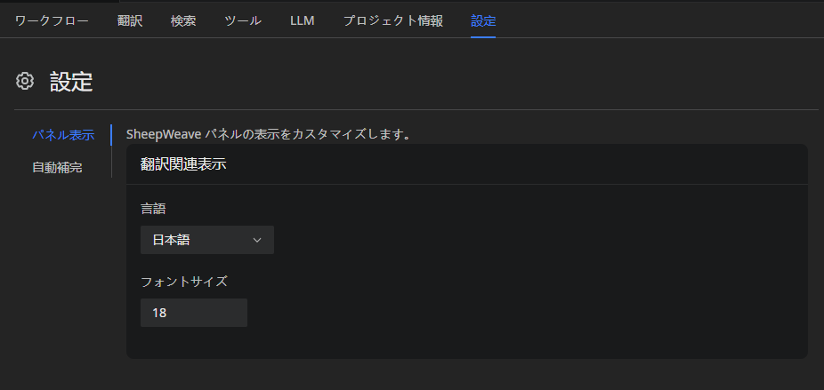
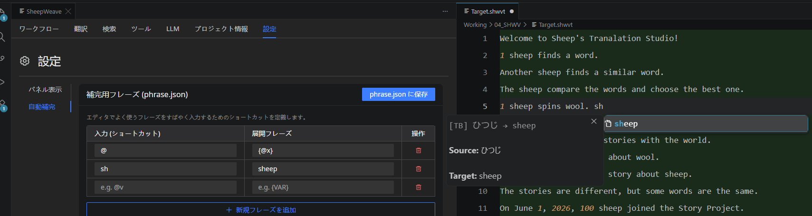

# 画面の見方

SheepWeave では、プログラミングエディタ「VS Code」の画面領域を活用して快適な翻訳環境を提供します。
基本的には、**左側にフォルダツリー、中央にエディタ画面、右側に SheepWeave パネル（および AI チャット）** を配置して作業を進めます。

## VS Code の画面構成

### 1. エディタ画面（中央）

実際の翻訳作業を行うメイン画面です。

- **翻訳用ファイル（`Target.shwvt`）**:
  - 原文をもとに作成された翻訳用ファイルを上書きしながら翻訳を進めます。
  - 数字や各種タグ（`{@0}`〜`{@1}` など）が色分けされて強調表示されます。
- **行の確定**:
  - `Ctrl + Enter` を押して行を確定すると、背景色が緑色に変わり、翻訳済み状態として記録されます。
- **行数固定ルール**:
  - 原文との 1 対 1 の対照性を保つため、**改行の追加や行の削除はできません**（改行を入れようとすると自動的に Undo されます）。

::: tip 画面分割の活用
`Ctrl + 2` を押すと画面を左右に分割できます。左側に `Target.shwvt`、右側に SheepWeave パネルや原文（`Source.shwvs`）を開くことで、快適に並行作業が可能です。
他にも、`Ctrl + 3` で 3 分割したり、`Ctrl + \` で上下に分割したりと、柔軟なレイアウトが可能です。自分の好みに合ったレイアウトを研究してみてください。
:::

### 2. フォルダツリー（左側）

プロジェクト内の各種ファイルやフォルダを表示する領域です。

- 翻訳中の `Target.shwvt` や参考資料、翻訳完了ファイル（`05_COMPLETED` や `06_PACKAGE`）などに素早くアクセスできます。
- 翻訳作業に集中したい時は、**`Ctrl + B`** を押すことでフォルダツリーを折りたたんで、エディタ画面を広く使うことができます。

### 3. AI チャット（右側）

VS Code のサイドバーや統合チャットペインで AI と直接対話できる機能です。

- **翻訳中の相談**: 訳語の選定、文脈の確認、自然な訳文へのリライトなどを AI に相談できます。
- **コンテキスト送信（AI チャット）**: エディタ上でテキストを選択し、**`Ctrl + L`** を押すと、VS Code や派生エディタの標準 AI チャットペインへ選択範囲を簡単に送信できます。
- **SheepWeave LLM パネルへの読み込み**: **`Ctrl + Q`** を押すと、選択中のテキストを SheepWeave パネル内の LLM タブに読み込んで処理・生成を行えます。

::: warning AI 利用時の注意点
AI に訳文を書き換えさせるプロンプトを実行する場合、行数が変わってしまうと SheepWeave の行数保護機能により変更がキャンセルされることがあります。
プロンプトには「行数を変えないこと」「ファイルを直接書き換えず、会話内で提示すること」といった指示を含めることをおすすめします。

また、AI は Copilot や Gemini など、エディタに内蔵されているものが使用されます。
クラウド AI の利用については、接続先をよく確認した上で、機密情報の取り扱いには十分気をつけてください。
VS Code には Ollama などのローカル AI と接続する拡張機能や、購入済みの有料 AI との接続機能なども準備されています。
こういった機能が必要であれば、一度調べてみることをおすすめします。
:::

## SheepWeave パネルの見方

SheepWeave の独自パネルは、翻訳を強力にアシストする各種タブで構成されています。
パネル内は **`Alt + 1` 〜 `Alt + 7`** のショートカットで即座に切り替えることができます。

---

### 1. ワークフロー `Alt + 1`
作業全体の進行を管理するタブです。

#### 初期化
フォルダ構造の作成やファイルの配置などを行うための機能が入っています。
フォルダ構成は同じフォルダを使いまわす場合、最初のみでOKです。
2回目以降は **準備** から開始することもできます。

#### 準備
ファイルのコピーと変換、解析を行うための機能が入っています。
新しいファイルやプロジェクトを始めるときは、ここからスタートしましょう。

#### 作業中
いったん中断した後に、引き続き翻訳作業を行う場合はここから再開できます。
また、原文や参考ファイルに追加があった場合も、この項目から随時追加と再解析ができます。

#### 完了
翻訳が完了した後に使う機能が入っています。
訳文を埋め込んだ XLIFF ファイルの生成のほか、Office などに戻す組み戻しや、現在のプロジェクトのアーカイブ化などが行えます。

#### 体験
チュートリアルを簡単に始めるために、初期化～準備の流れをまとめて行えるボタンです。

---

### 2. 翻訳 `Alt + 2`
翻訳作業中に最も頻繁に使用するメイン画面です。

#### 1. 原文表示
エディタでカーソルがある行の原文が常時表示されます。

#### 2. TM（翻訳メモリ）候補
過去の翻訳データから類似度の高い原文と訳文（差分ハイライト付き）を表示します。
このヒントは、類似度の高いものから 5 つまでです。
`Ctrl + Shift + 数字` で自動的に貼り付けることができます。

#### 3. TB（用語集）候補
該当行に含まれる登録用語と訳語が表示されます。
原文の該当する部分を選択するか、途中まで入力してから `Ctrl + Space` を押すと、入力を補完することができます。

#### ポストエディットの参考としてピン留め
原文の左側にあるピンアイコンをクリックすると、その行の原文、下訳、翻訳がポストエディットの参考としてマークされます。
後述の LLM 連携において、AI に自分の修正の好みを知らせたいときに活用できます。

---

### 3. 検索 `Alt + 3`
検索タブでは主に、**コンコーダンス検索** と **フィルタ** の 2 つの機能が使えます。

#### コンコーダンス
タブのタイトル部分で **コンコーダンス** を選択すると、コンコーダンス検索が可能です。

コンコーダンス検索は、翻訳メモリや既存のファイルから、特定の単語やフレーズの出現履歴を横断検索する機能です。

原文か訳文のどちらから検索するかを選択し、検索したい用語を入力すると、検索結果が一覧で表示されます。

コンコーダンス検索は、以下のショートカットから実行することもできます。

- 翻訳タブにあるテキストを選択して Ctrl + K：原文から検索
- 翻訳ファイルにあるテキストを選択して Ctrl + K：訳文から検索
- 翻訳ファイルにあるテキストを選択して Ctrl + Shift + K：原文から検索

#### フィルタ

フィルタはコンコーダンス検索と似ていますが、**現在のファイルからのみ検索する**、**原文と訳文で同時に条件を指定できる** **検索結果の訳文を編集することができる** という点が異なります。

検索結果の右側にある訳文列を編集し、最後に右上の **適用** をクリックすると、訳文ファイルに変更が適用されます。
（フィルタで変更された行は、確定済みであっても **未確定** に戻ります）

---

### 4. ツール

翻訳で便利なツールを収録したタブとなります。
Ver 0.1.1 現在、提供している機能は **差分** のみです。

#### 差分

翻訳をしていると、翻訳メモリから似ている文を適用して翻訳することがよくあります。
翻訳の際はそれでいいのですが、のちに確認のために戻った際に、「**本当に変更部分が修正されているか**」分からなくなるという欠点もあります。
それを防ぐため、この差分ツールでは、「現在の行の訳文と、翻訳メモリの訳文の間の差分」を表示することができます。
数字や用語など、細かな部分のみが変更されていることを簡単に確認できます。

また、現在の行に拘らずとも、好きなテキスト間の差分を確認できる「手動差分」機能も用意してあります。

#### QA

用語や数字、タグなどの不一致を検出する機能です。
現在、鋭意開発中です。

#### サブエディタ

長いテキストがあっても、SheepWeaveでは行数の変更ができないことから、自由に改行して見やすくするといった工夫ができません。
その不便を一時的に解消する機能になる予定です。
現在、鋭意開発中です。

---

### 5. LLM `Alt + 5`
AI による自動翻訳やポストエディットアシストの連携設定・実行を行います。

全文の翻訳・チェックはもちろん、選択した一部分のみの処理も可能です。さらに原文だけでなく、用語や類似訳、前後の情報やコンテキストを含めることも可能となっています。

この機能を利用するには、**SheepBobbin** が必要です。
詳細は後述の **LLM 連携** をご覧ください。

---

### 6. プロジェクト情報 `Alt + 6`
プロジェクトの文字数・単語数カウントや進捗率（確定率）などの統計情報を確認できます。

---

### 7. 設定 `Alt + 7`
パネルのカスタマイズや入力補完の設定ができます。

#### パネル表示

翻訳タブにおける原文・訳文のフォントサイズの調整が可能です。

::: info 言語について
Ver 0.1.1 現在、日本語以外は AI による機械翻訳となっています。
:::

#### 自動補完

`Ctrl + Space` による自動補完の内容を自由に追加できます（追加したテキストは `01_REF/phrase.jsonl` に追記されます）。

