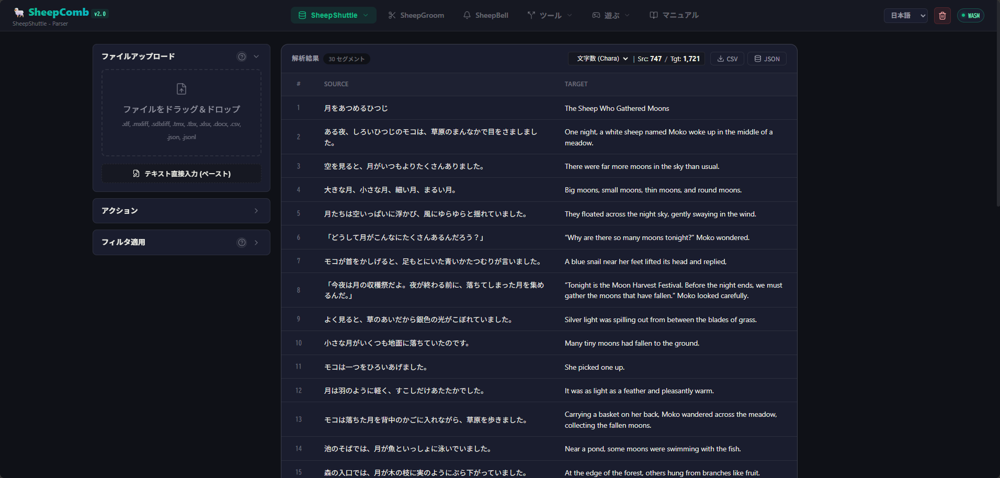

# 关于 SheepComb

SheepComb 是一款集成了**文件转换**、**双语对齐**、**LQA 辅助**以及**文本处理**等翻译与语言处理常用功能的 Web 应用程序。

:::info 关于数据处理
绝大部分功能完全在浏览器本地运行，除与 [SheepBobbin](/zh/docs/sheep-bobbin/) 联动时外，均支持离线使用。
:::

## SheepShuttle

在翻译工作中，我们经常需要处理双语数据。CAT 辅助翻译工具就是最典型的代表：左边原文、右边译文，逐句翻译……

但在实际工作中，您是否也遇到过以下困扰？
- 想直接导出为 Excel 进行整理
- 想批量纵向复制纯译文文本
- 在打开笨重软件前，无法直观确认哪些句子互相相似
- 虽有 AI 联动，但仅限软件自带的机械翻译
- XLIFF、TMX、TBX 文件分散各处难以统一管理

为了解决这些痛点，我们开发并持续扩展了 **SheepShuttle**。

SheepShuttle 的定位不是从零开始启动新翻译，而是最大化利用已有的翻译资产。它以现有的双语文件、翻译记忆库和术语表为基础：

- 从 XML（XLIFF 等）或 CSV 中提取翻译数据，完成字数统计与结构化（匹配 TM/TB）。
- 与翻译记忆库（TM）和术语表（TB）对照，快速检测完全匹配与模糊匹配。
- 自动检测标签损坏、数字不一致及术语违规（QA 质检）。
- 将数据切分为适合 AI 处理的“分块（Chunk）”，或保存为多种格式。
- 将分块数据与定制提示词批量发送给 AI，进行自动化翻译与审校。
- 注入丰富上下文的高精度结构化格式，完美适配本地与云端大模型。

如同织布机上的梭子（Shuttle）一般，SheepShuttle 能够将复杂的翻译数据清晰重构，并根据需要随时回写还原为工具专用格式。

若想了解使用 SheepShuttle 处理双语文件的详细操作，请参阅[此处](/zh/docs/sheep-comb/11_shuttle_steps_desc)。

## SheepGroom

在使用 Word、Excel 或 PowerPoint 进行翻译时，原文文件与译文文件往往是相互独立的。此时直接使用 SheepShuttle 会比较困难；而在排版（DTP）或网页制作中，成对的原译文对照往往更便于操作人员排版。

**对齐工具**正是为此而生：通过比对翻译前后的文档，自动建立句段间的映射对应关系。

虽然传统 CAT 工具也提供对齐功能，但在实际使用中常常存在不足：为什么非要丢弃“段落”、“工作表”、“幻灯片”、“备注”等结构信息，仅凭纯文本去生硬比对？

**SheepGroom** 采取了全新的设计思路：首先以“人类易于理解的结构单位”寻找对应关系，再根据需要进行精细化调整：
- 需要大块对照参考时直接保持段落/幻灯片层级
- 需要精确句级对齐时支持灵活手动调整

在调整过程中，SheepGroom 完整保留了“第几段”、“第几张幻灯片”、“同一文本框内”等上下文线索，确保译员在操作时绝不迷失语境。

若想了解使用 SheepGroom 创建双语对照的具体操作，请参阅[此处](/zh/docs/sheep-comb/21_groom_steps_desc)。

## SheepBell

SheepBell 源自我们团队在游戏 LQA（本地化质量保证）项目中的真实实战经验。

在进行 LQA 测试时，测试人员通常一边使用 OBS 录像，一边截屏记录问题，最后再汇总为测试报告。然而随着几小时的持续测试，截屏数量急剧增加：
- “这张图对应的是哪一场景？”
- “在录像的第几分第几秒？”

既然测试人员始终佩戴耳机麦克风，何不把发现问题时的口述语音直接作为时间戳标记呢？

**SheepBell** 将这一整套流程自动化：自动检测麦克风语音区间、精准切出对应片段视频、抓取关键帧截图，并结合 AI 语音转文字，全面辅助 LQA 的复盘与报告编制。

若想了解使用 SheepBell 开展 LQA 的具体操作，请参阅[此处](/zh/docs/sheep-comb/31_bell_steps_desc)。

# SheepComb 的使用方式

SheepComb 无需安装，可直接在现代浏览器（推荐 Google Chrome 等）中打开使用。
访问 [SheepComb](https://lambuage.com/app) 并选择所需功能即可。

*(注：SheepBell LQA 工具由于浏览器本地文件夹访问权限限制，在 Firefox 中可能受限，建议使用 Chromium 内核浏览器。)*
