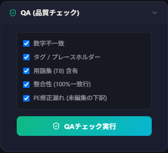
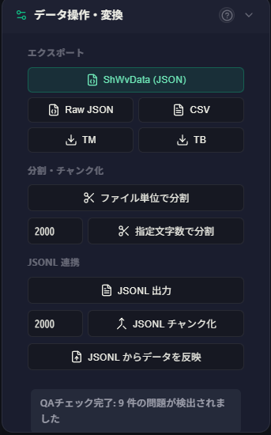
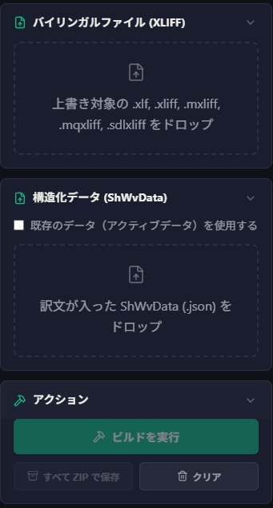

# SheepShuttle 双语数据处理基本流程

在 SheepComb 中，您可以按照顶部菜单的顺序逐步进行 SheepShuttle 的各项双语处理：

| 步骤 | 模式 | 概要说明 |
|:---:|:---|:---|
| 1a | **数据提取** | 从各类 XLIFF、TMX、TBX、Excel、CSV 文件中提取双语语料。 |
| 1b | **数据过滤与抽样** | 剔除重复行、锁定行或免译词句，并可生成用于质量评估的随机抽样集。 |
| 2 | **解析与结构化** | 匹配翻译记忆库（TM）与术语表（TB），并直观核算加权字数（WWC）。 |
| 3 | **数据管理与 QA 质检** | 直观确认匹配情况、执行自动 QA 检查（数字、标签、术语），并支持数据格式转换与分块。 |
| 4 | **构建回写** | 将调整后的双语数据重新注入回写至原始 XLIFF 文件中。 |
| 5 | **AI 请求（API 联动）** | 将分块数据与定制提示词批量发送至 AI 进行自动化翻译或质检。 |

# 各步骤详细操作指南

## 1a：数据提取

首先从目标文件中提取双语数据。

1. 从菜单中选择“提取”。
2. 将待处理文件拖放至左上角的上传区域，或点击选择文件。
3. 点击 **“执行解析”** 按钮。

::: tip 单元格内换行处理
若 Excel 或 XLIFF 文本中包含换行符，默认会在换行处分割。若希望保留整单元格内容，请取消勾选“按换行分割解析”。
:::

::: info 支持的文件格式
- **XLIFF 系列**：`.xliff`, `.xlf`, `.sdlxliff`, `.mxliff`, `.mqxliff`
- **翻译记忆库与术语表**：`.tmx`, `.tbx`
- **表格类**：`.xlsx`（A 列原文、B 列译文、C 列及以后备注）、`.csv`、`.tsv`、Word 表格、JSON/JSONL
:::

### 字数统计与导出
列表上方会显示预估字符数（Chara）与词数（Word），可随时点击切换。点击右上角的 **CSV** 或 **JSON** 按钮即可下载提取出的数据。

## 1b：数据过滤与抽样

完成数据提取后，**操作卡片**中将展示 **过滤** 与 **抽样** 功能。

| 功能名称 | 概要说明 |
|:---:|:---|
| **删除重复行** | 自动剔除完全相同的原文与译文配对（保留首个出现项）。 |
| **删除 LOCKED 锁定行** | 剔除被标记为锁定不可编辑的行（适用于 `.mxliff` / `.mqxliff`）。 |
| **无需翻译（DNT）过滤** | 自动识别并剔除无需翻译的行。 |

### 抽样评估
如需从海量数据中抽样进行质量评估，可设定目标字数与随机种子值，点击 **“执行抽样”** 导出子集。

## 2：解析与结构化

将提取并清洗后的数据转换为系统专用的结构化项目数据（`ShWvData`），并与翻译记忆库及术语表完成对齐关联。

1. 从菜单中选择“解析・结构化”。
2. 添加参考翻译记忆库（TM）或术语表（TB）文件。
3. 输入项目基础信息（项目名称、源语言、目标语言）。
4. 点击 **“执行解析・结构化”**。

### 加权字数核算（WWC）
根据相似度匹配区间直观计算并展示加权字数负担：

:::tip 格式支持说明
- **翻译记忆库 (TM)**：`.tmx`, `.xlf`, `.sdlxliff`, `.mxliff`, `.mqxliff`, `.csv`, `.xlsx`, `.json`, `.jsonl`
- **术语表 (TB)**：`.tbx`, `.xlf`, `.sdlxliff`, `.mxliff`, `.mqxliff`, `.csv`, `.xlsx`, `.json`, `.jsonl`
:::

## 3：数据管理与 QA 质检

### 数据可视化与匹配检查
在表格中直观查看术语表（TB）匹配高亮及翻译记忆库（TM）的相似度详情：

点击任意记录即可展开属性明细：

### QA 自动化质检
快速排查原译文中的格式与逻辑错误：

| QA 质检项 | 概要说明 |
|:---|:---|
| **数字不一致** | 检查原文与译文中的阿拉伯数字是否一一吻合。 |
| **标签 / 占位符** | 检查 `<>`、`{}`、`[]` 等标签和占位符配对是否完整一致。 |
| **术语表 (TB) 吻合** | 检查译文中是否正确采用了术语表指定的译名。 |
| **一致性 (100%匹配行)** | 检查相同原文在不同行之间是否存在译文不一致。 |
| **未修改机翻/下译遗留** | 在配合 **SheepWeave** 翻译时，排查是否遗留未确认修改的初翻行。 |

### 数据转换与分块
管理项目数据并为 AI 处理预先分块：

- **项目数据保存与读取**：导出全量 `.json` 项目文件，或随时导入恢复进度。
- **AI 分块（Chunk 化）**：按原始文件或指定字数阈值自动均分数据。
- **JSONL 导出与回写**：导出为适合大模型批量处理的 `.jsonl` 格式，处理完毕后一键回写合并。

## 4：构建回写

将处理后的结构化数据回写还原为翻译工具专用格式（XLIFF 等）：

选择原始双语 XLIFF 文件与调整后的结构化数据，点击 **开始构建**，即可生成 `<target>` 内容已更新的 XLIFF 交付文件。

## 5：AI（LLM）调用

配合桌面客户端（[SheepBobbin](/zh/docs/sheep-bobbin/)），批量向大模型发送翻译与质检请求。

1. 从菜单中选择“API”。
2. 输入连接密码建立通信连接。

3. 点击 **“创建分块”** 将数据拆解为合适片段。

4. 设置处理内容与参数：
   - **处理类型**：选择 `Check`、`Translate`、`Proof`、`Diff` 或 `Custom`。
   - **语言设定**：自动替换提示词中的 `{source_lang}` 与 `{target_lang}`。
   - **提示词**：编辑发送给大模型的具体指令。
5. 点击 **“处理所有分块”** 批量排队执行。
6. 处理完毕后直接查看 AI 审校意见：

7. 点击 **“导出 CSV”** 导出完整报告。

::: tip 单分块重新请求
点击分块右上角的刷新按钮，可单独针对该分块重新发起 AI 请求。

:::

### 处理类型对照表

| 处理类型 | 发送字段 | 适用场景 |
|:---|:---|:---|
| **Check** | 原文（`src`）、译文（`tgt`）、备注（`note`） | AI 翻译审校质检 |
| **Translate** | 原文（`src`）、备注（`note`） | 全新翻译或参考翻译 |
| **Proof** | 译文（`tgt`） | 单语母语润色 |
| **Diff** | 修改前（`src`）、带标记修改后（`tgt`）、备注（`note`） | 文本修订评估 |
| **Custom** | 可自由勾选（`src`, `tgt`, `note`, `history`, `terms`） | 高级上下文注入 |
