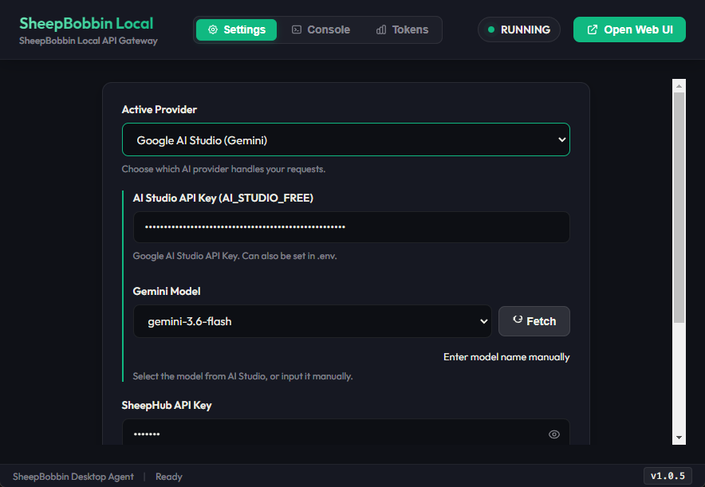
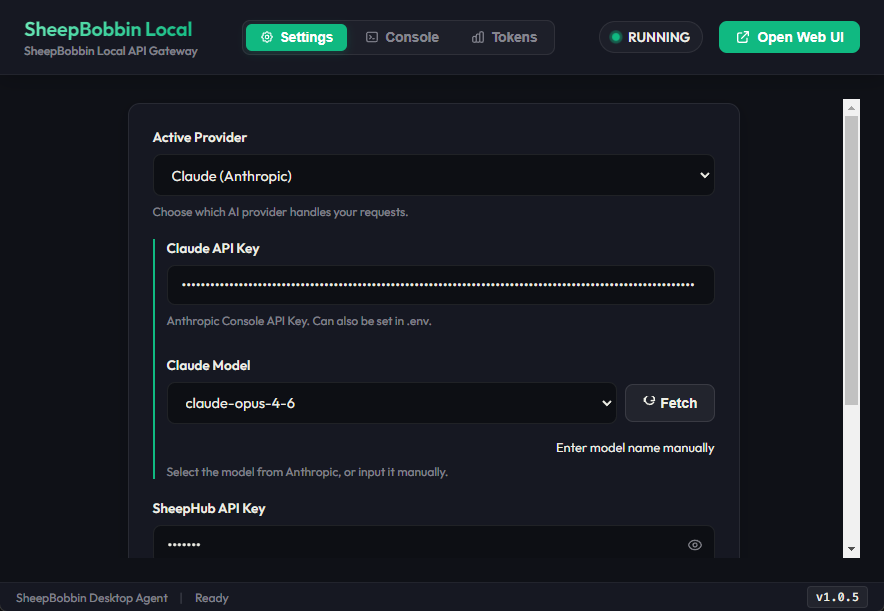

:::warning
本页面由 Gemini 机器翻译。
:::

# 与云端 LLM 通信

SheepBobbin 支持与主流云端大模型 API 的无缝通信。

## Google AI Studio

AI Studio 支持在浏览器中快速创建 API 密钥。使用 Google 账号登录 AI Studio 后，点击右上角的 **“Create API key”**，输入项目名称（选择新建项目即可）并生成密钥。
创建完成后复制该 API Key。在 SheepBobbin 的 Active Provider 下拉列表中选择 **AI Studio** 并粘贴密钥。
此时 SheepBobbin 会自动拉取当前可用的 Gemini 模型列表（或手动点击 **Fetch**）。显示模型列表后，即可返回 SheepCombWeb 正常使用。

::: tip
AI Studio 提供免费版与付费版。免费层级的 API 调用数据可能会根据条款用于模型迭代训练；绑定账单后升级为付费 API，则不会将数据用于训练。
无论免费还是付费，只要填入有效的 API Key，SheepBobbin 均可正常发起处理。处理商业机密或敏感情报时请务必谨慎。
:::

## ChatGPT（OpenAI）

OpenAI（ChatGPT）的 API Key 可在 [OpenAI Platform](https://platform.openai.com/) 中创建。

1. 访问 [OpenAI Platform](https://platform.openai.com/) 并登录（或注册）OpenAI 账号。
2. 打开左侧菜单的 **API keys**（或右上角设置菜单内）。
3. 点击 **“Create new secret key”** 按钮。
4. 输入密钥名称（例如：`SheepBobbin`），按需选择 Project，然后点击 **“Create secret key”**。
5. 系统将显示生成的 API Key（以 `sk-...` 开头的字符串）。**关闭此窗口后将无法再次查看完整密钥**，请务必立即复制并妥善保存。
6. 在 SheepBobbin 的 **Active Provider** 中选择 **ChatGPT**（或 OpenAI）并粘贴密钥。点击 OpenAI Model 右侧的 **Fetch** 按钮，当模型列表（`gpt-4o`, `gpt-4o-mini` 等）加载出来后即表示配置完成。

::: tip
* **与网页版订阅（ChatGPT Plus / Team 等）的区别**:
  即使已订阅 ChatGPT Plus（每月 20 美元），API 接口的计费体系仍是完全独立的。使用 API 需要在 OpenAI Platform 的 **Settings > Billing** 中预先购买并充值账户余额（Credit balance，最低约 5 美元起）。
* **数据隐私安全**:
  通过 OpenAI API 发送的数据默认不会被用于模型训练。
:::

## DeepSeek

DeepSeek 的 API Key 可通过 [DeepSeek Platform](https://platform.deepseek.com/) 获取。其性价比极高，在翻译任务中表现优异。

1. 访问 [DeepSeek Platform](https://platform.deepseek.com/) 注册或登录账号。
2. 点击左侧菜单中的 **“API keys”**。
3. 点击 **“Create API key”** 按钮。
4. 输入密钥标识名称（例如：`SheepBobbin`）并确认创建。
5. 复制并保存生成的 API Key（以 `sk-...` 开头，关闭后无法重新查看）。
6. 在 SheepBobbin 的 **Active Provider** 中选择 **DeepSeek** 并粘贴密钥。当可用模型（`deepseek-chat`, `deepseek-reasoner` 等）列表正常显示时即表示连接成功。

::: tip
* **余额充值**:
  使用 DeepSeek API 需先在左侧菜单的 **Top up** 中充值少许使用额度。
* **数据隐私安全**:
  通过 API 发送和接收的数据不会被用于模型训练。
:::

::: warning
虽然 DeepSeek 的基础单价非常优惠，但截至 2026/9/8，在默认配置下用于翻译任务时往往会消耗较多 Token。
我们正在分析具体原因并调优最佳配置参数，但现阶段建议优先考虑其他供应商/模型。
:::

## Claude（Anthropic）

Claude 的 API Key 可在 Anthropic 开发者控制台 [Anthropic Console](https://console.anthropic.com/) 中创建。

1. 访问 [Anthropic Console](https://console.anthropic.com/) 并注册或登录账号。
2. 点击控制台主页的 **“Get API Keys”** 或通过右上角菜单进入 **API Keys** 页面。
3. 点击 **“Create Key”** 按钮。
4. 输入名称（例如：`SheepBobbin`），点击 **“Create Key”**。
5. 复制并妥善保存生成的 API Key（以 `sk-ant-...` 开头）。
6. 在 SheepBobbin 的 **Active Provider** 中选择 **Claude**（Anthropic）并粘贴密钥。可用模型（`claude-3-5-sonnet`, `claude-3-5-haiku` 等）将自动列出。

::: tip
* **与网页版订阅（Claude Pro 等）的区别**:
  与 Claude Pro 订阅状态无关，API 使用需在 Anthropic Console 的 **Plans & Billing** 页面预先购买 Token 额度。
* **数据隐私安全**:
  通过 Anthropic 商业 API 发送的数据不会被用于模型训练。
:::

## Vertex AI（Google Cloud 企业级平台）

Vertex AI 是 Google Cloud Platform (GCP) 提供的企业级 AI 云平台。相比面向个人开发者的 AI Studio，Vertex AI 具备更高的并发能力、更严格的企业级数据安全保障与更稳定的 SLA。

配置需要开通 GCP 账号并绑定项目账单。若觉得配置较为繁琐，可考虑使用我们计划提供的企业托管共享服务。
