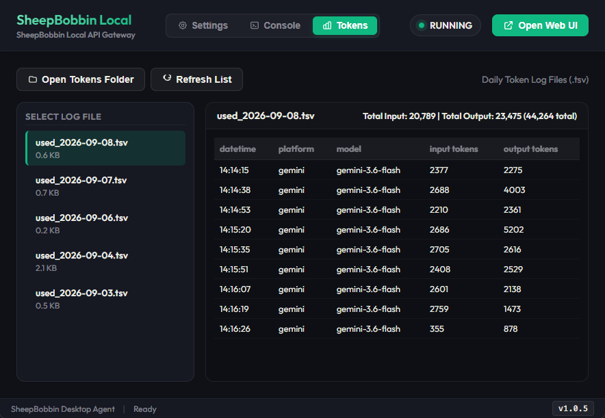

:::warning
本页面由 Gemini 机器翻译。
:::

# SheepBobbin 控制台与日志说明

在 SheepBobbin 顶部导航栏中点击 **Console**，即可打开控制台界面。
在此界面中，您可以实时查看从 SheepCombWeb 或 SheepWeave 接收到的处理请求，以及连接的 AI 模型返回的响应信息。

::: tip 控制台输出日志详细度
勾选 Settings（设置）界面最下方的 **Enable Request Debug Logs**（启用请求调试日志），除了常规的请求与响应外，还会显示并记录包含请求头（Headers）、耗时等更详尽的诊断信息。
:::

控制台输出的所有日志信息均会自动保存至 `server.log` 文件中。点击顶部的 **Open Logs** 即可打开日志文件所在的本地文件夹，便于排查故障或进行审计。

若您不需要查看网络请求与耗时细节，而仅想查阅 AI 返回的原始回答内容（例如网络中断时找回生成结果），可以点击 **Open Responses**。该文件夹按日期以 JSONL 格式归档保存了全部原始响应。

# Token 消耗统计与记录

云端 AI 大模型通常根据消耗的 Token 数量进行计费。在执行一定批量的翻译任务后，通常需要核对 Token 使用情况。
此时点击顶部导航栏中的 **Tokens**，即可查看 Token 消耗统计看板。

Token 消耗数据按天汇总归类，您可以在左侧日期菜单中选择对应日期进行预览。
此外，Token 统计数据以 `.tsv` 格式存储，方便批量导入 Excel、Google Sheets 等电子表格软件进行统计与成本核算。
若要直接查看原始数据文件而非预览面板，请点击 **Open Tokens Folder** 打开保存文件夹。
