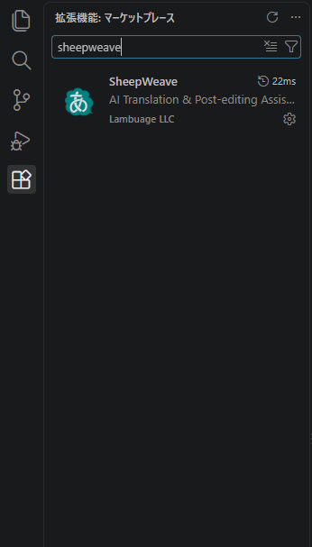
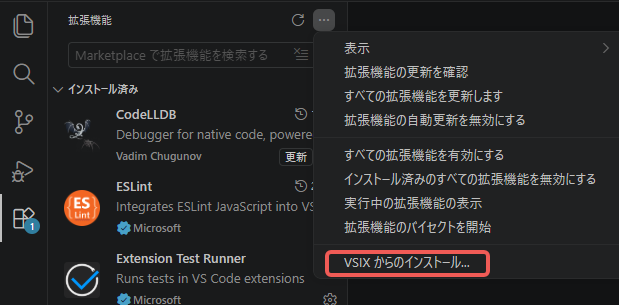

:::warning
本页面由 Gemini 机器翻译。
:::

# 使用入门

SheepWeave 是一款旨在融合现代编程代码编辑器极致体验的新一代计算机辅助翻译（CAT）工具。

现代代码编辑器（集成开发环境/IDE）集成了极其丰富的高效工具。不仅能够对特定语法进行精准高亮着色、提供上下文感知输入联想补全，还能高度自由定制快捷键，并一键完成“选中文本添加括号或标签”等操作。

更重要的是，当今 IDE 均深度集成了 AI 能力。除了在侧边栏直接进行对话外，在编辑过程中 AI 还会结合前后文语境实时提供智能建议。例如，将“not more than 1%”翻译为“不超过1%”后，后续遇到类似句段只需轻按一次 `Tab` 键即可一键转换。这一特性在机器翻译后编辑（MTPE）中尤能大显身手，轻松完成语态转换或全文语气统一。

如此强大的 IDE 若仅用于编程实属可惜。SheepWeave 正是本着这一初衷而诞生，致力于打造一款让习惯 Office 直接覆盖翻译的用户和资深 CAT 工具老手都能快速顺手适应的新型翻译利器。

***

# 软件安装

## 1. 编辑器本体

SheepWeave 基于 Visual Studio Code (VS Code) 开发，作为其扩展插件运行。

因此使用前需安装 VS Code 或其衍生 IDE（Cursor、Windsurf、Antigravity IDE、TRAE 等）。所有软件均跨平台且免费提供。

::: tip 官方下载地址
- [VS Code](https://azure.microsoft.com/products/visual-studio-code)
- [Cursor](https://cursor.com/)
- [Windsurf](https://windsurf.com/)
- [Antigravity IDE](https://antigravity.google/)
- [TRAE](https://www.trae.ai/)
:::

### 可选组件（用于 Office 等办公文档翻译）

SheepWeave 单体即可直接翻译 XLIFF（mxliff、sdlxliff 等）格式。
若需直接翻译 Word 或 Excel 等 Office 文件，则需借助开源格式转换工具 **Okapi Framework** 及 **Java** 运行时环境。
详细配置步骤请参阅 [实际文件翻译实操](./03_actual_translation)，建议初次体验可先从 XLIFF 文件开始。

## 2. 扩展插件安装（`SheepWeave.vsix`）

### 在 VS Code 应用市场中安装

SheepWeave Ver 0.1.3 及以上版本已发布至插件市场。
点击 VS Code 左侧活动栏的“扩展”图标，在搜索框中输入 `SheepWeave` 即可一键安装。

### 通过 VSIX 离线包安装

在离线环境或需要安装特定历史版本时：

::: tip 离线包下载
访问 <a href="https://storage.lambuage.com/#latest" target="_blank" rel="noopener noreferrer">官方发布页面</a> 下载 vsix 文件。
:::

在 VS Code 扩展面板（`Ctrl + Shift + X`）中点击搜索框右上角的 `...` 菜单，选择 **从 VSIX 安装...** 并选取下载的文件即可。

## 3. 启动扩展插件

插件安装完成后，VS Code 底部状态栏右侧将新增 **SheepWeave** 图标。

点击该按钮即可展开 SheepWeave 的控制面板。

::: info 常见问题排查
若未显示该按钮，可按 `Ctrl + Shift + P` 打开命令面板，输入 **SheepWeave: Open Panel** 并回车。
若仍未显示，可能是 VS Code 处于“受限模式”，请在底部栏中点击“管理 > 信任工作区”。
:::

至此安装已全部就绪！接下来请跟随教程，一起体验在代码编辑器中轻快翻译的全新魅力！
