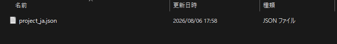
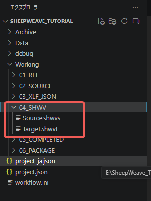
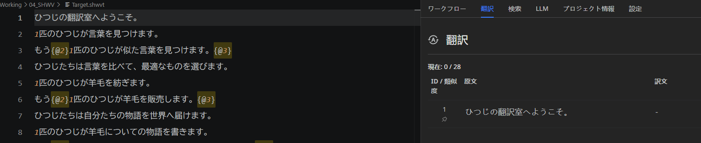

:::warning
本页面由 Gemini 机器翻译。
:::

# 基础体验教程

::: info Mac 用户操作提示
Mac 用户请将本指南中的 `Ctrl` 键替换为 `Cmd` (`⌘`)，`Alt` 键替换为 `Option` (`⌥`)。
:::

本章节旨在通过示例文件，带您快速上手体验 SheepWeave 的核心 CAT 辅助翻译功能。

## 1. 创建项目文件夹

首先在电脑中创建一个空文件夹（如在“文档”中创建 `SheepWeave_Tutorial`）。

## 2. 放置示例文件

从 <a href="https://storage.lambuage.com/#samples" target="_blank" rel="noopener noreferrer">官方示例下载页</a> 下载示例包，解压后将其中的 `JSON` 文件移入上述创建的项目文件夹中。

## 3. 在 VS Code 中打开项目

1. 启动 VS Code。
2. 点击 `文件 > 打开文件夹...`，选择刚才创建的项目文件夹。
3. 点击右下角状态栏的 **SheepWeave** 图标展开侧边面板。

## 4. 开始翻译

### 第一步：解包并生成翻译文件

在面板中打开 **工作流（Flow）** 选项卡，在左侧导航选择 **体验（Experience）** 并点击执行按钮。
系统将自动解包并生成各类目录，其中 `04_SHWV` 目录下会生成 `Source.shwvs`（原文）与 `Target.shwvt`（待翻译工作文件）。

双击打开 **`Target.shwvt`** 文件。

::: tip 推荐分屏布局
按 `Ctrl + 2` 将编辑器分为左右两栏，左侧放 `Target.shwvt`，右侧放 SheepWeave 翻译面板。按 `Ctrl + B` 可折叠左侧文件树以获得最充裕的编辑视野。
:::

### 第二步：句段翻译与确认

将面板切换至 **翻译（Translate）** 选项卡（快捷键 `Alt + 2`）。
将光标移至 `Target.shwvt` 第 1 行，面板侧边将实时同步显示第 1 行的原文。

直接在编辑器中对第 1 行进行覆写翻译。

::: warning 禁止增删换行符
为保障原文与译文的严格逐行对齐，**系统严格锁定了总行数**。若误按回车增删换行，系统会自动 Undo 撤销。
:::

翻译完成后按 **`Ctrl + Enter`** 进行 **句段确认（Confirm）**。第 1 行背景色将变为绿色，同时光标自动跳转至下一行。

### 第三步：应用记忆库与相似句

光标移至第 2 行时，观察 Translate 面板下方的 TM 匹配区，系统会自动展示第 1 行的相似历史译文并高亮显示差异。
按 **`Ctrl + Shift + 1`** 即可一键将第 1 条 TM 候选译文应用至当前行！根据差异微调后按 `Ctrl + Enter` 确认即可。

### 第四步：格式标签（Tag）处理

翻译过程中若遇到 `{@0}`...`{@1}` 等特殊标记，代表原文件中的加粗、超链接等格式。翻译时请在对应译文周围保留对应标签，以确保导出文件保持原有排版格式。

全部句段翻译完成后，按 **`Ctrl + S`** 保存文件即可，所有译文已完整同步至 `project.json` 中！
