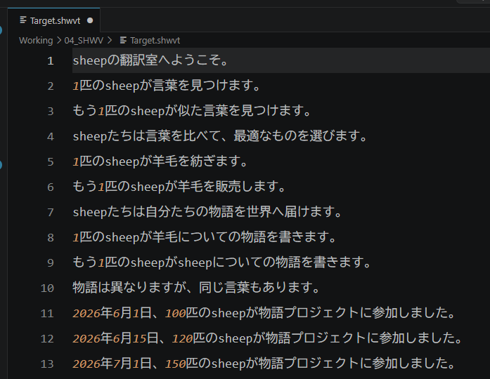

:::warning
本页面由 Gemini 机器翻译。
:::

# 简易替换推荐指南

“简易替换”功能灵感源自现代代码编辑器中极其便捷的 `F2 重命名（Rename）`。

与普通查找替换不同，“简易替换”会自动将每一次替换记录追加记录至 `01_REF/auto_replace_log.jsonl` 日志中。
这些沉淀下来的日志会在后续项目中自动转化为**术语资产与智能补全短语**！

因此在 SheepWeave 中进行翻译时，强烈推荐充分运用此功能。

## 简易替换操作步骤

1. 选中待替换的文本词汇。

2. 按下 **`F2`** 键。

3. 此时屏幕将弹出浮动输入框，输入替换后的译名并按 **`Enter`** 确认。

系统将自动在全文范围内完成替换，并实时记录至 `01_REF/auto_replace_log.jsonl`。

如需撤销可直接按 `Ctrl + Z`，调出输入框后若想取消可按 `Esc` 退出。
