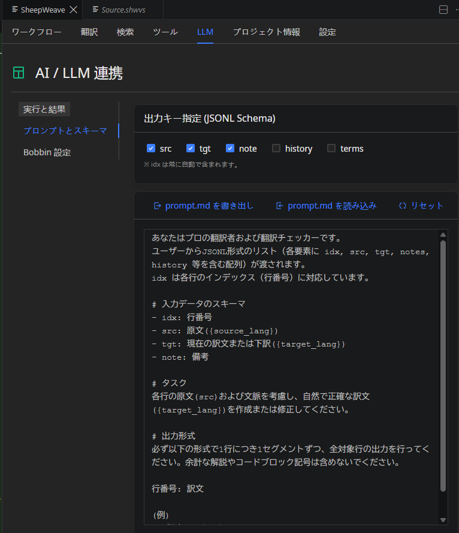

:::warning
本页面由 Gemini 机器翻译。
:::

# LLM / AI 深度联动

SheepWeave 具备深度整合的大语言模型（LLM）AI 联动功能，支持一键初翻生成、机器翻译后编辑（MTPE）润色以及智能审校。

所有 AI 请求均通过轻量安全的伴生桌面客户端 **SheepBobbin** 代理完成。

---

## 1. 安装 SheepBobbin
**SheepBobbin** 是连接 SheepWeave 与各类 LLM（OpenAI、Anthropic Claude、Google Gemini、本地 Ollama 等）的安全通信桥梁。

启动 SheepBobbin 并在本地常驻运行。
*(详细配置请参阅 [SheepBobbin 用户手册](/zh/sheep-bobbin/))*。

---

## 2. 配置通信认证密钥
在 VS Code 中配置连接：
- 按 `Ctrl + ,` 打开设置，搜索 `sheepWeave.bobbinApiKey` 并填入密钥。
- 或直接在 SheepWeave 面板的 **Settings** 选项卡中填入。

---

## 3. SheepWeave LLM 面板操作（`Alt + 5`）

### 提示词（Prompt）定制与管理
- 支持根据具体行业领域（技术规范、市场文案、对话风格）定制系统 Prompt。
- 支持将定制提示词导出为 JSON 预设文件或一键导入加载。

### 快捷调用
- **`Ctrl + Q`**：一键将编辑器中选中的句段内容载入 LLM 面板。

### 请求模式
- **普通模式**：对当前单个句段发起翻译或润色建议。
- **高级模式**：自动注入上下文、前文已确认译文以及用户图钉锁定的参考译例（PE Ref），保障全文风格与术语高度统一。
- **全文批量请求**：自动将整篇文档切分为最佳尺寸的数据块，并以进度条可视化形式批量执行自动化处理。
